<p align="right">Abdullah Agah Kanat<br>Oct, 2022</p>

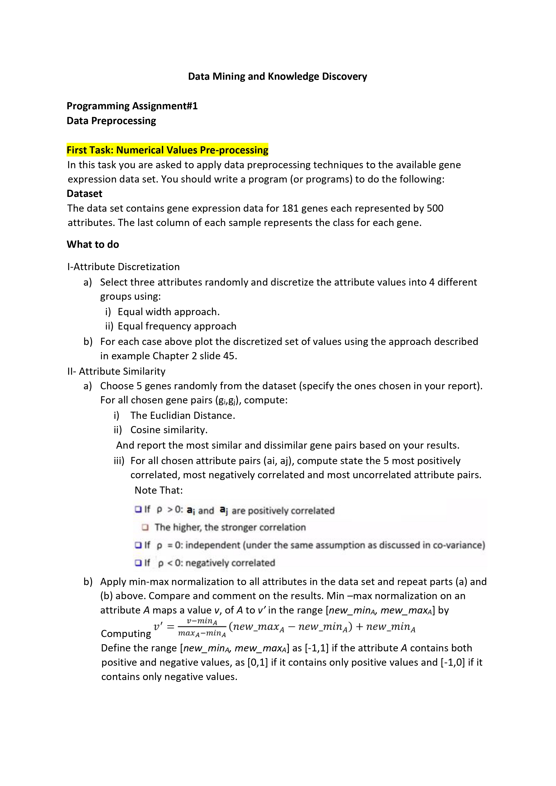
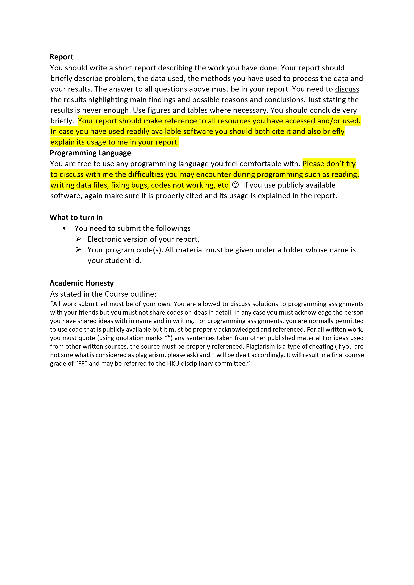

# **1. INTRODUCTION**

In this project, we will apply some data pre-processing techniques to the expression of 181 genes, each represented by 500 attributes, with the python program. Using the Pandas library, the dataset was taken and converted into a list. The matplotlib library was used to generate the desired plots. The Random library was used to make random selections from the data, and finally the NumPy library was used to use the arrange() and linspace() functions. These are the only libraries required to run this program. Python IDLE was preferred as the editor and functions were avoided as much as possible while writing the codes. The codes contain calculations simply and in different ways. Where necessary, explanations are made with comment lines. In this study, firstly, a discretization was obtained by applying the equal width approach and the equal frequency approach on three randomly selected data. We will also see the distributions of the data on the graph for each gene used. Euclidian Distance was then calculated for five randomly selected genes. For this, calculations were made as double combinations of five gene data. Then, Cosine Similarity calculations were made on the same five pairs, and calculations were made for each 2-combination of these five genes. Then, Correlation calculations were made on the same data groups. Finally, all the data used were normalized according to the negative and positive numbers in each gene. With the new data set obtained, we will re-apply all the operations we have applied before, and we will report the results in this report. Analysis and tables will be used where necessary for results. The code and the dataset used will be available with the report.


# **2 PROCESSES**

In this section, operations will be performed on the data set with the methods specified for Attribute Discretization and Attribute Similarity.
## </a>**2.1 Attribute Discretization**
In this section, equal width approach and equal frequency approach will be applied for three randomly selected genes.

```
import pandas as pd
import matplotlib.pyplot as plt
import numpy
import random
df = pd.read_csv('PA1data')
data_list = df.values.tolist()


random1 = random.randint(0,179)
random2 = random.randint(0,179)
random3 = random.randint(0,179)

value1 = data_list[random1]
value2 = data_list[random2]
value3 = data_list[random3]
```

*Figure 1 - Data Selection*

### **2.1.1 Equal Width Approach**
We will use 4 different groups for this process. First we need to find the width value. For this, we will divide the difference between the highest value and the smallest value in the gene by the number of groups we want. The first width value that we will add to the smallest value later will be our first border. Then we will add the same width value to the result we found, determine the other two borders and place all the data in these 4 groups.


#### 2\.1.1.1 Codes for First Random Gene

```
#Discretization
#Question1>a>I-----------------------------------------------------------------------------
#Calculating width for 4 different groups
#Calculating the width
width = (max(value1)-min(value1))/4
width = round(width,1)
print("Width for {}. gene is : {}".format(random1, width) )

#Calculating the borders
firstline = min(value1)+width
secondline = min(value1)+width+width
thirdline = min(value1)+width+width+width

firstline = round(firstline,1)
secondline = round(secondline,1)
thirdline  = round(thirdline,1)

group1forvalue1 = []
group2forvalue1 = []
group3forvalue1 = []
group4forvalue1 = []

#Placing the values to the groups for value 1 list
for i in range(500):
    if (value1[i]< firstline):
        group1forvalue1.append(value1[i])
        
    elif (value1[i]<secondline):
        group2forvalue1.append(value1[i])

    elif (value1[i]<thirdline):
        group3forvalue1.append(value1[i])
    else:
        group4forvalue1.append(value1[i])

print("Equal width approach for {}. gene : ".format(random1))
print("\nThe attributes between {} and {} :".format(min(value1), firstline))
print(group1forvalue1)
print("\nThe attributes between {} and {} :".format(firstline, secondline))
print(group2forvalue1)
print("\nThe attributes between {} and {} :".format(secondline, thirdline))
print(group3forvalue1)
print("\nThe attributes between {} and {} :".format(thirdline, max(value1)))
print(group4forvalue1)

if(len(group1forvalue1)>0):
    x_axis1_1 = numpy.linspace(min(group1forvalue1), max(group1forvalue1),len(group1forvalue1))
    plt.scatter(x_axis1_1 , group1forvalue1, color='g')

if(len(group2forvalue1)>0):
    x_axis2_1 = numpy.linspace(min(group2forvalue1), max(group2forvalue1),len(group2forvalue1))
    plt.scatter(x_axis2_1 , group2forvalue1, color='r')

if(len(group3forvalue1)>0):
    x_axis3_1 = numpy.linspace(min(group3forvalue1), max(group3forvalue1),len(group3forvalue1))
    plt.scatter(x_axis3_1, group3forvalue1, color='b')

if(len(group4forvalue1)>0):
    x_axis4_1 = numpy.linspace(min(group4forvalue1), max(group4forvalue1),len(group4forvalue1))
    plt.scatter(x_axis4_1, group4forvalue1, color='hotpink')
   
plt.axvline(x = firstline, color = 'r')
plt.axvline(x = secondline, color = 'b')
plt.axvline(x = thirdline, color = 'hotpink')
plt.title("Equal width approach for {}. gene : ".format(random1))
plt.xlabel("Width")
plt.ylabel("The attribute value of the gene")
plt.show()
```
*Figure 2 - First Random Gene's Equal Width Approach Process*

#### 2\.1.1.2 Outputs for First Random Gene

```
Width for 72. gene is : 1590.0
Equal width approach for 72. gene : 

The attributes between -509.8 and 1080.2 :
[369.7, 49.3, -26.8, -187.7, 18.7, 935.5, 11.8, 475.7, 347.4, 969.6, 164.0, 9.6, 124.5, 11.6, 6.1, 105.7, -102.1, 11.2, 25.6, 24.4, 106.8, 27.4, 17.2, 1.5, -116.4, -29.4, 30.0, -30.6, 8.6, 3.6, 12.3, 36.1, 675.4, 61.9, 111.4, 24.5, 313.5, 452.3, 25.7, -11.2, 281.4, 424.1, 17.6, 23.5, -6.9, 173.7, 0.8, 95.2, 33.9, 32.5, 38.8, 43.4, -24.2, 48.4, 6.1, 42.6, 864.8, 11.5, 17.9, 77.9, 20.2, 7.6, -4.8, 0.8, 7.4, 47.9, 61.0, 216.0, 15.6, 93.8, 33.6, -43.8, 12.1, -143.2, 27.9, 95.7, 26.7, -41.9, 83.5, 330.7, 136.4, 3.7, 28.0, 11.8, -3.8, 111.3, 6.9, -33.1, 656.0, 40.0, 281.4, -13.2, 186.8, 9.5, -9.8, -7.0, -50.2, -94.7, 8.5, 90.1, 19.2, 15.8, -37.2, -2.0, 131.3, 41.5, 14.4, -107.8, 113.0, 146.5, -32.8, 43.9, -11.9, 393.6, 504.3, 373.4, 556.5, -12.3, -5.4, 207.3, 71.5, 112.1, 98.7, 10.4, 9.1, 41.1, 76.9, 378.9, 68.1, 278.0, 86.8, 8.7, 3.0, 348.9, -165.8, 20.9, 64.1, 102.0, 128.4, 101.2, -35.1, 23.3, 360.5, 184.7, 42.8, 11.0, 199.7, 23.7, 93.6, 62.7, 382.6, 13.0, 8.4, 32.9, 37.7, 46.6, 22.6, 25.3, -2.9, 97.9, 12.3, 100.5, -9.8, -7.1, 104.2, 528.9, -2.0, 105.0, 99.7, 234.0, 18.8, 15.5, 368.0, -7.8, 81.3, 401.9, 127.6, 28.9, 76.3, 10.1, 731.7, 135.0, 14.1, -2.5, 24.2, 94.0, 30.8, -28.5, -17.2, 19.9, 75.7, 46.9, -1.5, 676.7, 42.9, 12.4, 8.9, 13.5, 923.5, 68.5, -6.4, 16.6, -11.3, 81.8, -27.2, -3.8, 338.8, 51.4, -51.7, -23.5, 50.5, 72.9, 110.5, 4.3, -30.0, -0.3, -7.7, 8.1, -53.7, -1.1, 21.4, 42.5, -87.3, 8.6, 162.8, -134.2, 31.9, 39.6, 23.2, -19.9, 24.4, 147.4, -34.0, 618.7, 89.9, 19.7, -2.3, 31.3, 125.8, 236.3, 5.8, -47.0, 229.1, 151.7, -53.4, 215.6, 30.2, 41.5, -96.2, -0.9, -5.3, 606.7, 56.7, 15.3, 25.4, 135.9, 425.9, 97.8, 131.5, 177.1, 7.5, -7.2, -46.0, 342.7, 5.4, 75.6, -54.5, 256.7, 86.6, 100.3, 43.8, 32.8, 83.0, 60.9, 57.8, -144.7, 53.8, -8.0, 118.9, 8.8, 15.1, -15.4, 14.7, 848.9, 24.7, -4.9, 82.6, 280.9, 68.0, 128.0, 87.2, 5.9, 153.5, 24.8, 56.0, 18.1, 132.0, 8.3, -5.0, -6.5, -37.6, -4.6, 7.1, 176.8, 95.0, 90.0, 60.0, 65.6, -27.3, -18.7, 253.1, 479.2, 139.3, -72.3, 1.7, -5.7, 50.5, 230.2, 28.8, 10.3, 126.6, 335.2, 23.2, 36.0, 366.7, -53.1, 705.9, 432.5, 426.7, 340.2, 329.6, 77.4, 84.6, 104.5, 52.6, 18.6, 10.8, 40.5, 73.1, 6.0, 72.8, 63.4, 56.0, 18.1, -146.1, -84.3, 32.6, 48.5, -46.9, -79.4, -52.5, 33.8, 19.1, 25.4, 157.4, 1052.4, -11.1, 44.1, 0.7, 25.4, -35.6, 8.1, 298.6, 188.6, 19.2, -2.7, -6.4, 21.6, 25.4, -71.1, 5.0, 50.1, 38.8, 250.1, 147.7, 109.1, 4.6, 7.1, 19.6, 89.5, 60.7, 2.0, -7.1, -12.3, 131.8, 18.1, -77.5, 276.5, 111.7, 60.4, 55.9, -509.8, 199.1, -31.1, 155.5, 170.4, -2.4, 11.7, 20.6, 11.1, 26.9, 232.4, 18.2, 164.1, -36.0, 61.6, 104.1, 85.4, 59.3, -82.3, 83.5, -2.1, 767.1, 539.0, 717.7, 54.9, 482.6, 348.5, -4.8, 3.0, 8.6, 243.3, 453.2, 30.9, 179.6, 38.3, 21.3, -14.5, 102.4, 235.5, 34.2, 46.5, 44.5, -16.1, -43.6, 236.6, -8.3, 3.6, -28.4, 82.9, -8.4, -2.5, 14.5, 18.1, 17.4, 245.4, 90.3, -15.7, -23.5, -3.7, 32.6, 118.0, 86.0, 30.9, -0.2, 0.0, -11.4, 84.1, 59.0, 15.5, 50.7, 6.8, 118.4, 136.8, -19.5, 86.6, 59.8, 257.6, 369.2, 520.2, -6.9, 923.0, 632.2, 112.1, 92.1, 41.6, 160.3, 143.2, 57.6, 32.8, -3.4, 63.2, 516.4, -180.4, 209.8]

The attributes between 1080.2 and 2670.2 :
[1106.5, 1598.1, 1443.0, 1325.0, 1814.9, 1916.6, 1106.7, 1399.9, 1361.0, 1232.2]

The attributes between 2670.2 and 4260.2 :
[2783.0, 3109.6, 2738.3, 3840.5]

The attributes between 4260.2 and 5850.3 :
[5850.3]
```

*Figure 3 - Output of The First Random Gene's Equal Width Approach Process*

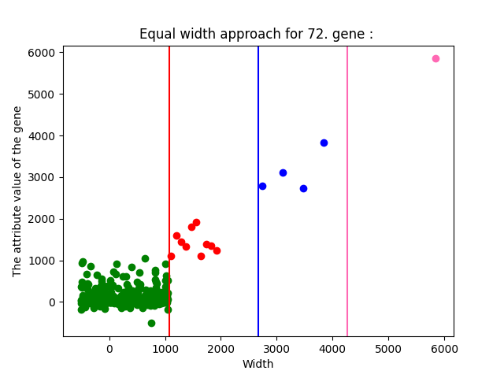

*Figure 4 - The Scatterplot of The First Random Gene's Equal Width Approach*
#### 2\.1.1.3 Codes for Second Random Gene
```
#Calculating the width
width2 = (max(value2)-min(value2))/4
width2 =round(width2,1)
print("\n\nWidth for {}. gene is : {}".format(random2, width2) )

#Calculating the borders
firstline2 = min(value2)+width2
secondline2 = min(value2)+width2+width2
thirdline2 = min(value2)+width2+width2+width2

firstline2 = round(firstline2,1)
secondline2 = round(secondline2,1)
thirdline2 = round(thirdline2,1)

group1forvalue2 = []
group2forvalue2 = []
group3forvalue2 = []
group4forvalue2 = []

#Placing the values to the groups for value 2 list
for i in range(500):
    if (value2[i]< firstline2):
        group1forvalue2.append(value2[i])
        
    elif (value2[i]<secondline2):
        group2forvalue2.append(value2[i])

    elif (value2[i]<thirdline2):
        group3forvalue2.append(value2[i])
    else:
        group4forvalue2.append(value2[i])

print("Equal width approach for {}. gene : ".format(random2))
print("\nThe attributes between {} and {} :".format(min(value2), firstline2))
print(group1forvalue2)
print("\nThe attributes between {} and {} :".format(firstline2, secondline2))
print(group2forvalue2)
print("\nThe attributes between {} and {} :".format(secondline2, thirdline2))
print(group3forvalue2)
print("\nThe attributes between {} and {} :".format(thirdline2, max(value2)))
print(group4forvalue2)


if(len(group1forvalue2)>0):
    x_axis1_2 = numpy.linspace(min(group1forvalue2), max(group1forvalue2),len(group1forvalue2))
    plt.scatter(x_axis1_2, group1forvalue2, color='g')

if(len(group2forvalue2)>0):
    x_axis2_2 = numpy.linspace(min(group2forvalue2), max(group2forvalue2),len(group2forvalue2))
    plt.scatter(x_axis2_2, group2forvalue2, color='r')

if(len(group3forvalue2)>0):
    x_axis3_2 = numpy.linspace(min(group3forvalue2), max(group3forvalue2),len(group3forvalue2))
    plt.scatter(x_axis3_2, group3forvalue2, color='b')

if(len(group4forvalue2)>0):
    x_axis4_2 = numpy.linspace(min(group4forvalue2), max(group4forvalue2),len(group4forvalue2))
    plt.scatter(x_axis4_2, group4forvalue2, color='hotpink')

plt.axvline(x = firstline2, color = 'r')
plt.axvline(x = secondline2, color = 'b')
plt.axvline(x = thirdline2, color = 'hotpink')
plt.title("Equal width approach for {}. gene : ".format(random2))
plt.xlabel("Width")
plt.ylabel("The attribute value of the gene")

plt.show()
```

*Figure 5 - Second Random Gene's Equal Width Approach Process*

#### 2\.1.1.4 Output for Second Random Gene

```
Width for 179. gene is : 4804.1
Equal width approach for 179. gene : 

The attributes between -392.9 and 4411.2 :
[172.9, -5.4, -69.5, -80.6, -72.9, 222.3, 97.6, 292.9, 399.9, 301.0, 1.2, 179.7, 60.9, -54.2, 122.4, -71.4, -31.4, 97.3, 21.0, 192.8, 1.0, 196.2, 14.7, -33.2, -38.6, -25.1, 17.9, 60.5, 129.8, 271.4, -36.6, 157.1, 532.0, 56.0, 260.1, 51.5, 270.1, 594.3, 84.3, 191.6, 253.1, 517.5, -133.4, -11.8, 66.1, 31.3, -55.4, 110.9, 71.8, 68.0, 3.5, 1.3, -159.6, -52.8, -83.1, -3.0, 1512.4, -58.4, 12.7, -19.4, 16.9, -59.9, -42.4, 12.9, -20.8, 36.0, 64.6, 209.9, -11.7, -30.3, 87.0, 103.0, 93.8, -236.9, 105.2, 27.7, -4.4, -14.3, 83.1, 222.1, 44.2, 9.6, -19.2, 43.3, 44.7, 69.8, 155.4, -85.4, 713.5, 136.3, 97.6, -69.5, 196.5, 29.5, 85.5, -83.4, -17.6, -153.6, 24.9, 94.7, -103.1, 11.5, -57.7, -111.7, 212.0, 177.0, -61.3, -76.3, 62.8, 226.6, 100.0, 12.1, -31.9, 551.6, 691.5, 196.0, 818.5, -40.8, -87.6, 114.6, 115.1, 128.8, 85.2, -58.9, -4.3, -85.4, 112.1, 386.8, 154.9, 321.8, -74.9, 103.8, -35.0, 449.0, -121.7, -2.9, 120.0, 129.0, 408.3, 99.9, -43.4, 40.6, 224.4, 155.5, 61.8, 113.6, 292.2, 148.7, 10.5, 141.7, 1073.6, -33.1, -102.2, -36.2, 31.0, 115.5, -15.0, 122.4, -106.6, 78.6, 26.6, 124.1, -58.8, 63.0, 102.2, 516.4, -30.0, -392.9, 31.8, 463.6, 45.3, -5.8, 365.6, -9.8, 75.9, 78.8, 382.3, 66.1, -59.2, -29.8, 45.1, 393.7, 312.6, -12.9, 31.1, -21.8, 185.0, 65.7, -244.9, 3692.8, -14.3, -14.9, 76.4, 86.9, 26.0, 472.9, 62.5, 1230.1, 28.2, -29.8, 104.0, 761.1, 89.1, 71.0, 78.2, -99.4, 21.4, -109.6, -57.6, 14.6, -5.8, -147.1, 61.0, 2.3, 44.4, 71.0, 50.0, 926.7, -68.2, 37.8, -117.6, 122.0, -215.1, -14.0, 62.7, 76.6, -33.3, -84.7, 230.1, -80.7, 77.9, 29.9, -14.5, -50.7, 21.4, -30.0, -77.8, 534.5, 110.9, 142.9, 4.0, 20.1, 114.8, 227.4, 20.5, -128.1, 2.4, -35.6, -78.8, 226.8, 9.2, 27.5, -153.6, -30.7, 1044.9, -63.9, 1012.2, 95.4, -57.4, 25.2, 113.7, 627.7, 15.3, 332.7, 232.7, -33.2, -55.4, -0.4, 109.6, 26.0, 30.7, -61.4, 237.3, 60.5, 152.3, -117.1, -24.4, 185.2, -15.3, -94.7, -86.5, 95.4, 29.1, 49.0, 12.9, 65.1, -89.6, 39.2, 694.7, 122.0, -92.2, 135.1, 244.0, -18.1, 53.9, 123.1, 3.0, -30.7, 204.1, 66.1, 55.3, 244.0, -131.3, 20.2, -38.1, -14.3, 50.4, 52.0, 1.7, -46.2, 112.9, 93.1, 6.8, -12.1, -91.4, 155.3, 757.2, 171.2, 34.0, 7.0, 27.5, 72.3, 151.2, 97.4, -88.7, 122.2, 145.8, 13.6, 143.4, 348.9, -9.9, 383.5, 419.1, 194.6, 154.2, 243.9, 313.0, -12.8, -16.7, 26.7, -0.3, -152.7, 34.7, 158.0, 1673.7, 68.0, 73.4, 82.5, 106.2, -64.3, -261.3, -139.4, 146.8, 94.5, -62.2, -64.9, -66.3, -55.4, -27.3, 14.3, 553.5, 341.4, -43.7, 37.2, 61.0, -59.1, -34.2, 68.8, -30.8, 123.4, 40.8, -116.6, -47.2, -45.9, -38.1, -63.2, -38.7, 56.5, 83.6, 150.7, 236.2, 1570.3, -14.0, -2.7, -6.2, 152.7, 83.5, -43.4, 11.1, -58.3, 286.9, 77.6, 41.3, 587.5, 30.3, 1.1, 15.2, -267.5, 516.4, 40.9, 136.8, 79.3, 200.4, -72.1, 29.2, -11.8, 36.3, 186.7, 110.2, 976.3, 337.4, -65.4, 128.9, 232.1, -28.6, 115.5, 36.0, 247.2, -36.4, 811.3, 728.7, 458.2, 89.6, 342.9, 205.8, -89.9, 74.2, 87.9, 227.4, 370.4, 46.5, 248.9, 195.2, -9.9, -23.4, 153.7, 205.8, -38.7, 330.8, 5.9, -14.6, 18.6, 699.4, 10.9, 52.7, -1.0, -100.7, 10.5, 692.4, 8.0, 59.1, 10.5, 1391.2, 13.0, 92.4, 105.9, -11.7, 67.6, -132.7, 112.5, -156.4, 22.7, 128.4, -84.0, -99.4, -60.2, 70.8, 21.8, -41.6, 57.8, 8.6, 191.1, 210.6, -59.8, -119.7, 114.9, 194.7, 598.7, 27.5, 143.5, -105.9, 499.0, 1028.3, 87.4, -20.4, 104.2, 307.7, 58.6, 41.5, 8.7, 75.1, 42.0, 1226.0, -140.7, 208.9]

The attributes between 4411.2 and 9215.3 :
[7990.2, 4446.6, 4720.1]

The attributes between 9215.3 and 14019.4 :
[9795.0]

The attributes between 14019.4 and 18823.6 :
[18823.6]
```
*Figure 6 - Output of The Second Random Gene's Equal Width Approach Process*

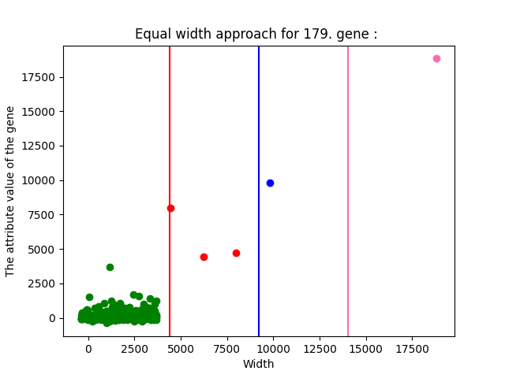

*Figure 7 - The Scatterplot of The Second Random Gene's Equal Width Approach*

#### 2\.1.1.5 Code for Third Random Gene 
```
#Calculating the width
width3 = (max(value3)-min(value3))/4
width3 = round(width3,1)
print("\n\nWidth for {}. gene is : {}".format(random3, width3) )

#Calculating the borders
firstline3 = min(value3)+width3
secondline3 = min(value3)+width3+width3
thirdline3 = min(value3)+width3+width3+width3

firstline3 = round(firstline3,1)
secondline3 = round(secondline3,1)
thirdline3 = round(thirdline3,1)

group1forvalue3 = []
group2forvalue3 = []
group3forvalue3 = []
group4forvalue3 = []

#Placing the values to the groups for value 3 list
for i in range(500):
    if (value3[i]< firstline3):
        group1forvalue3.append(value3[i])
        
    elif (value3[i]<secondline3):
        group2forvalue3.append(value3[i])

    elif (value3[i]<thirdline3):
        group3forvalue3.append(value3[i])
    else:
        group4forvalue3.append(value3[i])

print("Equal width approach for {}. gene : ".format(random3))
print("\nThe attributes between {} and {} :".format(min(value3), firstline3))
print(group1forvalue3)
print("\nThe attributes between {} and {} :".format(firstline3, secondline3))
print(group2forvalue3)
print("\nThe attributes between {} and {} :".format(secondline3, thirdline3))
print(group3forvalue3)
print("\nThe attributes between {} and {} :".format(thirdline3, max(value3)))
print(group4forvalue3)


if(len(group1forvalue3)>0):
    x_axis1_3 = numpy.linspace(min(group1forvalue3), max(group1forvalue3),len(group1forvalue3))
    plt.scatter(x_axis1_3, group1forvalue3, color='g')

if(len(group2forvalue3)>0):
     x_axis2_3 = numpy.linspace(min(group2forvalue3), max(group2forvalue3),len(group2forvalue3))
     plt.scatter(x_axis2_3, group2forvalue3, color='r')

if(len(group3forvalue3)>0):
    x_axis3_3 = numpy.linspace(min(group3forvalue3), max(group3forvalue3),len(group3forvalue3))
    plt.scatter(x_axis3_3, group3forvalue3, color='b')

if(len(group4forvalue3)>0):
    x_axis4_3 = numpy.linspace(min(group4forvalue3), max(group4forvalue3),len(group4forvalue3))
    plt.scatter(x_axis4_3, group4forvalue3, color='hotpink')

plt.axvline(x = firstline3, color = 'r')
plt.axvline(x = secondline3, color = 'b')
plt.axvline(x = thirdline3, color = 'hotpink')
plt.title("Equal width approach for {}. gene : ".format(random3))
plt.xlabel("Width")
plt.ylabel("The attribute value of the gene")

plt.show()
```
*Figure 8 - Third Random Gene's Equal Width Approach Process*

#### 2\.1.1.6 Outputs for Third Random Gene

```
Width for 126. gene is : 3230.3
Equal width approach for 126. gene : 

The attributes between -278.9 and 2951.4 :
[205.8, 86.9, 52.7, -133.2, 57.6, 2040.1, 510.4, 394.0, 874.2, 683.4, 127.6, 20.9, 258.9, 26.9, 6.3, 70.9, 6.1, 29.0, 33.7, -57.5, 75.4, 3.3, 430.2, 6.7, 12.5, -185.5, -40.1, 27.6, 47.4, 41.6, 59.6, 16.7, 31.9, 298.4, 43.2, 101.5, 30.3, 272.7, 283.2, 20.5, -26.7, 389.8, 400.9, 31.7, 41.7, 69.9, 120.0, 1.0, 55.1, 67.5, 26.1, -4.0, 25.3, -14.9, 89.7, -12.1, -22.0, 1675.0, -5.1, 36.5, 49.1, 13.3, 233.7, -37.3, 11.0, 13.3, 24.7, 64.8, 131.2, 73.1, 53.0, 17.0, -9.2, 141.2, 6.4, 138.6, 62.1, 58.9, 31.6, 117.2, 251.0, 186.9, 12.1, 15.8, -6.0, 1.9, 53.6, -28.9, -32.6, 364.8, 20.8, 943.8, -29.9, 187.0, -16.4, -0.7, -0.7, -40.7, -48.1, 39.3, 43.0, 1.0, 11.7, -26.5, -1.0, 185.2, 101.5, -14.6, -71.3, 73.0, 141.3, 10.4, 64.0, -35.0, 298.3, 294.0, 132.2, 620.9, 4.6, 0.6, 376.6, 82.6, 1.3, 142.6, 182.3, 66.6, 48.0, 105.8, 649.4, 104.5, 221.7, 73.9, 4.8, 11.4, 352.6, -39.9, 56.3, 229.4, 348.2, 241.2, 43.7, 0.6, -11.2, 121.1, 265.2, -14.8, 22.7, 267.9, 99.4, -1.6, 58.9, 450.0, 19.0, 14.9, -34.8, 73.4, 69.2, 45.2, 20.0, 35.2, 73.0, 43.0, 31.4, 7.3, -61.8, 119.5, 582.0, 15.3, 111.0, 100.1, 217.0, 26.4, -0.5, 457.4, 20.3, 89.3, 187.1, 1233.9, 119.3, 35.3, 5.9, 48.2, 398.5, 266.2, -2.5, 26.7, 28.5, 128.6, 55.1, -75.0, -23.1, 41.2, 41.5, 83.6, 3.7, 622.3, 146.8, 1094.4, 28.2, 4.0, 26.3, 400.7, 138.6, -1.4, 19.7, -13.6, 66.1, -6.0, 6.4, 163.8, 66.4, -41.2, -28.9, 4.3, 30.1, 17.5, 26.0, 709.6, -94.3, 20.2, -3.4, 22.8, -70.4, 27.2, 46.2, 70.0, -48.8, -11.2, 115.8, -89.7, 39.4, 15.9, 35.0, -19.2, 27.5, 106.1, -33.5, 460.5, 156.3, 46.7, 0.6, 76.7, 125.8, 111.6, -11.2, -52.3, 110.7, 35.2, -6.3, 8.2, 29.0, 17.8, -104.9, -23.4, 886.1, 10.1, 832.7, 19.8, 3.1, 8.5, 70.3, 525.0, 170.6, 130.7, 211.2, 17.2, 1.4, -28.9, 220.2, 7.5, 43.8, 51.4, 263.5, 54.2, 95.9, 34.3, 34.7, 283.9, 49.0, 122.3, -101.7, 3.7, 14.8, 105.6, 11.9, 21.0, 19.7, 79.2, 703.0, 15.9, -1.0, 257.3, 288.1, 12.8, 157.1, 130.6, 20.9, 198.2, 149.7, 81.8, -17.8, 261.3, -36.9, 22.6, 16.4, 17.9, 7.6, 6.0, 168.6, 77.7, 118.6, 72.6, 96.2, -56.0, -24.5, 188.5, 294.9, 168.2, 23.6, -0.3, -5.5, 129.2, 202.1, 36.7, 13.2, 71.5, 281.3, 44.2, 54.3, 278.7, 113.3, 454.2, 422.7, 374.7, 246.5, 154.7, 65.7, 34.8, 122.6, 56.5, 25.4, -28.5, 52.1, 75.5, 1823.9, 47.5, 106.3, 91.2, 71.6, 22.3, -92.7, -41.8, 41.8, 55.8, 6.6, 36.9, -35.6, 44.0, 56.1, 5.8, 146.3, 545.8, -24.7, 130.4, 8.3, 81.4, 17.2, -26.6, 563.1, 138.1, 17.5, -4.2, 9.9, -7.5, 68.8, -80.8, 58.3, 14.0, 26.9, 136.2, 127.5, 179.4, -16.2, -13.0, 23.5, 81.6, 106.7, 45.3, -19.9, 2.9, 330.3, 161.8, -127.8, 328.4, 447.4, 77.4, 52.3, -278.9, 314.5, 6.4, 126.5, 50.5, 61.4, -45.2, 37.5, 0.5, 23.6, 143.7, 15.3, 783.7, 166.4, -41.7, 78.8, 27.2, 120.5, 111.9, -91.9, 359.6, -6.2, 644.5, 485.6, 795.3, 75.0, 408.1, 320.0, -18.0, 36.9, -61.9, 181.0, 195.7, 8.9, 100.7, 15.2, 21.7, -1.9, 143.8, 200.4, 24.6, 284.5, -26.0, -10.3, -23.4, 267.1, 3.1, 5.9, -49.0, 87.8, -0.1, 1282.2, 1.4, 8.0, 26.6, 912.2, -17.3, 187.2, 95.7, -46.9, -3.2, -29.3, 57.1, 69.6, 86.8, 12.6, 3.5, 16.8, 18.3, 76.3, 178.8, 20.2, 51.4, 17.5, 187.2, 136.7, -13.1, 127.8, 81.5, 203.0, 764.1, 203.5, 169.2, 11.7, 322.0, 935.1, 91.8, 134.3, 105.8, 206.4, 147.3, -125.5, 108.2, 7.7, 104.6, 1294.1, -178.1, 215.1]

The attributes between 2951.4 and 6181.7 :
[3575.0, 3295.4, 3754.2, 5753.0]

The attributes between 6181.7 and 9412.0 :
[]

The attributes between 9412.0 and 12642.2 :
[12642.2]
```

*Figure 9 - Output of The Third Random Gene's Equal Width Approach Process*

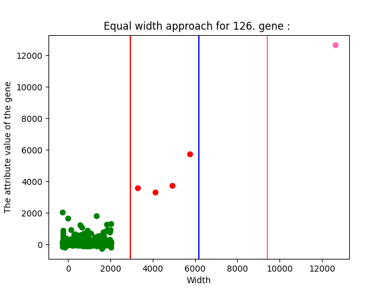

*Figure 10 - The Scatterplot of The Third Random Gene's Equal Width Approach*
### **2.1.2 Equal Frequency Approach**
We will use 4 different groups for this process. First we need to find the frequency value. For this we will divide the number of data in the gene by the number of groups. The first frequency value we will add later, starting from zero, will be our first limit. Then we will add the same frequency value to the result we found, determine the other two limits and place all the data in these 4 groups.
#### 2\.1.2.1 Codes for First Random Gene

```
#Question1>a>II-----------------------------------------------------------------------------
#Calculating the frequency for any object
print(len(value1))
frequency = int(len(value1)/4)

print("\n\n\n\nThe Frequency is : ", frequency)

group1_forvalue1_forfrequency = []
group2_forvalue1_forfrequency = []
group3_forvalue1_forfrequency = []
group4_forvalue1_forfrequency = []


for i in range(frequency):
    group1_forvalue1_forfrequency.append(value1[i])
for i in range(frequency,2*frequency):
    group2_forvalue1_forfrequency.append(value1[i])
for i in range(2*frequency,3*frequency):
    group3_forvalue1_forfrequency.append(value1[i])
for i in range(3*frequency,(int(len(value1)))):
    group4_forvalue1_forfrequency.append(value1[i])
    
print("\n\nEqual frequency approach for {}. gene : ".format(random1))
print("\nThe attributes between {} and {} :".format(0, frequency))
print(group1_forvalue1_forfrequency)
print("\nThe attributes between {} and {} :".format(frequency, frequency*2))
print(group2_forvalue1_forfrequency)
print("\nThe attributes between {} and {} :".format(frequency*2, frequency*3))
print(group3_forvalue1_forfrequency)
print("\nThe attributes between {} and {} :".format(frequency*3, len(value1)))
print(group4_forvalue1_forfrequency)


 
x1_1 = numpy.arange(0,frequency)
plt.scatter(x1_1, group1_forvalue1_forfrequency, color='g')

x1_2 = numpy.arange(frequency,2*frequency)
plt.scatter(x1_2, group2_forvalue1_forfrequency, color='r')

x1_3 = numpy.arange(2*frequency,3*frequency)
plt.scatter(x1_3, group3_forvalue1_forfrequency, color='b')

x1_4 = numpy.arange(3*frequency,4*frequency+1)
plt.scatter(x1_4, group4_forvalue1_forfrequency, color='hotpink')

plt.axvline(x = frequency, color = 'r')
plt.axvline(x = 2*frequency, color = 'b')
plt.axvline(x = 3*frequency, color = 'hotpink')
plt.title("Equal frequency approach for {}. gene : ".format(random1))
plt.xlabel("Frequency")
plt.ylabel("The attribute value of the gene")
plt.show()
```
*Figure 11 - First Random Gene's Equal Frequency Approach Process*

#### 2\.1.2.2 Outputs for First Random Gene

```
The Frequency is :  125


Equal frequency approach for 72. gene : 

The attributes between 0 and 125 :
[369.7, 49.3, -26.8, -187.7, 18.7, 935.5, 11.8, 475.7, 347.4, 969.6, 164.0, 9.6, 124.5, 11.6, 6.1, 105.7, -102.1, 11.2, 25.6, 24.4, 106.8, 27.4, 1106.5, 17.2, 1.5, -116.4, -29.4, 30.0, -30.6, 8.6, 3.6, 12.3, 36.1, 675.4, 61.9, 111.4, 24.5, 313.5, 452.3, 25.7, -11.2, 281.4, 424.1, 17.6, 23.5, -6.9, 173.7, 0.8, 95.2, 33.9, 32.5, 38.8, 43.4, -24.2, 48.4, 6.1, 42.6, 864.8, 11.5, 17.9, 77.9, 20.2, 7.6, -4.8, 0.8, 7.4, 47.9, 61.0, 216.0, 15.6, 93.8, 33.6, -43.8, 12.1, -143.2, 27.9, 95.7, 26.7, -41.9, 83.5, 330.7, 136.4, 3.7, 28.0, 11.8, -3.8, 111.3, 6.9, -33.1, 656.0, 40.0, 281.4, -13.2, 186.8, 9.5, -9.8, -7.0, -50.2, -94.7, 8.5, 90.1, 19.2, 15.8, -37.2, -2.0, 131.3, 41.5, 14.4, -107.8, 113.0, 146.5, -32.8, 43.9, -11.9, 393.6, 504.3, 373.4, 556.5, -12.3, -5.4, 207.3, 71.5, 112.1, 98.7, 10.4]

The attributes between 125 and 250 :
[9.1, 41.1, 76.9, 378.9, 68.1, 278.0, 86.8, 8.7, 3.0, 348.9, -165.8, 20.9, 64.1, 102.0, 128.4, 101.2, -35.1, 23.3, 360.5, 184.7, 42.8, 11.0, 199.7, 23.7, 93.6, 62.7, 382.6, 13.0, 8.4, 32.9, 37.7, 46.6, 22.6, 25.3, -2.9, 97.9, 12.3, 100.5, -9.8, -7.1, 104.2, 528.9, -2.0, 105.0, 99.7, 234.0, 18.8, 15.5, 368.0, -7.8, 81.3, 401.9, 1598.1, 127.6, 28.9, 76.3, 10.1, 731.7, 135.0, 14.1, -2.5, 24.2, 94.0, 30.8, -28.5, 2783.0, -17.2, 19.9, 75.7, 46.9, -1.5, 676.7, 42.9, 1443.0, 12.4, 8.9, 13.5, 923.5, 68.5, -6.4, 16.6, -11.3, 81.8, -27.2, -3.8, 338.8, 51.4, -51.7, -23.5, 50.5, 72.9, 110.5, 4.3, 1325.0, -30.0, -0.3, -7.7, 8.1, -53.7, -1.1, 21.4, 42.5, -87.3, 8.6, 162.8, -134.2, 31.9, 39.6, 23.2, -19.9, 24.4, 147.4, -34.0, 618.7, 89.9, 19.7, -2.3, 31.3, 125.8, 236.3, 5.8, -47.0, 229.1, 151.7, -53.4]

The attributes between 250 and 375 :
[215.6, 30.2, 41.5, -96.2, -0.9, 1814.9, -5.3, 606.7, 56.7, 15.3, 25.4, 135.9, 425.9, 97.8, 131.5, 177.1, 7.5, -7.2, -46.0, 342.7, 5.4, 75.6, -54.5, 256.7, 86.6, 100.3, 43.8, 32.8, 83.0, 60.9, 57.8, -144.7, 53.8, -8.0, 118.9, 8.8, 15.1, -15.4, 14.7, 848.9, 24.7, -4.9, 82.6, 280.9, 68.0, 128.0, 87.2, 5.9, 153.5, 24.8, 56.0, 18.1, 132.0, 8.3, -5.0, -6.5, -37.6, -4.6, 7.1, 176.8, 5850.3, 95.0, 90.0, 60.0, 65.6, -27.3, -18.7, 253.1, 479.2, 139.3, -72.3, 1.7, -5.7, 50.5, 230.2, 28.8, 10.3, 126.6, 335.2, 23.2, 36.0, 366.7, -53.1, 705.9, 432.5, 426.7, 340.2, 329.6, 3109.6, 77.4, 84.6, 104.5, 52.6, 18.6, 10.8, 40.5, 73.1, 1916.6, 6.0, 72.8, 63.4, 56.0, 18.1, -146.1, -84.3, 32.6, 48.5, -46.9, -79.4, -52.5, 33.8, 19.1, 25.4, 157.4, 1052.4, -11.1, 44.1, 0.7, 25.4, -35.6, 8.1, 298.6, 188.6, 19.2, -2.7]

The attributes between 375 and 501 :
[-6.4, 21.6, 25.4, -71.1, 5.0, 50.1, 38.8, 250.1, 147.7, 109.1, 4.6, 7.1, 19.6, 89.5, 60.7, 2.0, -7.1, -12.3, 2738.3, 3840.5, 131.8, 18.1, -77.5, 276.5, 111.7, 60.4, 55.9, -509.8, 199.1, -31.1, 155.5, 170.4, -2.4, 11.7, 20.6, 11.1, 26.9, 232.4, 18.2, 1106.7, 164.1, -36.0, 61.6, 104.1, 85.4, 59.3, -82.3, 83.5, -2.1, 767.1, 539.0, 717.7, 54.9, 482.6, 348.5, -4.8, 3.0, 8.6, 243.3, 453.2, 30.9, 179.6, 38.3, 21.3, -14.5, 102.4, 235.5, 34.2, 46.5, 44.5, -16.1, -43.6, 236.6, -8.3, 3.6, -28.4, 82.9, -8.4, 1399.9, -2.5, 14.5, 18.1, 1361.0, 17.4, 245.4, 90.3, -15.7, -23.5, -3.7, 32.6, 118.0, 86.0, 30.9, -0.2, 0.0, -11.4, 84.1, 59.0, 15.5, 50.7, 6.8, 118.4, 136.8, -19.5, 86.6, 59.8, 257.6, 1232.2, 369.2, 520.2, -6.9, 923.0, 632.2, 112.1, 92.1, 41.6, 160.3, 143.2, 57.6, 32.8, -3.4, 63.2, 516.4, -180.4, 209.8, 0.0]
```

*Figure 12 - Output of The First Random Gene's Equal Frequency Approach Process*

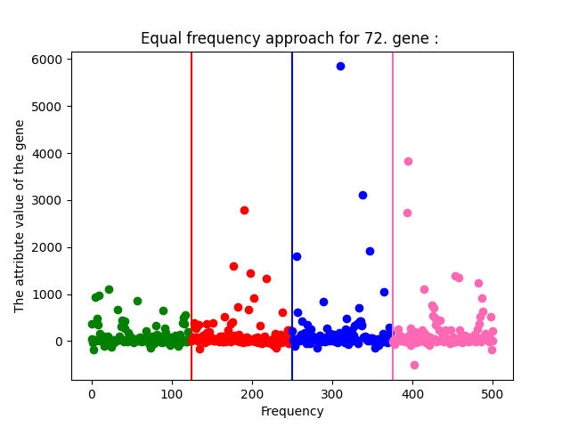

*Figure 13 - The Scatterplot of The First Random Gene's Equal Frequency Approach*
#### 2\.1.2.3 Codes for Second Random Gene

```
group1_forvalue2_forfrequency = []
group2_forvalue2_forfrequency = []
group3_forvalue2_forfrequency = []
group4_forvalue2_forfrequency = []


for i in range(frequency):
    group1_forvalue2_forfrequency.append(value2[i])
for i in range(frequency,2*frequency):
    group2_forvalue2_forfrequency.append(value2[i])
for i in range(2*frequency,3*frequency):
    group3_forvalue2_forfrequency.append(value2[i])
for i in range(3*frequency,(int(len(value2)))):
    group4_forvalue2_forfrequency.append(value2[i])

print("\n\nEqual frequency approach for {}. gene : ".format(random2))
print("\nThe attributes between {} and {} :".format(0, frequency))
print(group1_forvalue2_forfrequency)
print("\nThe attributes between {} and {} :".format(frequency, frequency*2))
print(group2_forvalue2_forfrequency)
print("\nThe attributes between {} and {} :".format(frequency*2, frequency*3))
print(group3_forvalue2_forfrequency)
print("\nThe attributes between {} and {} :".format(frequency*3, len(value2)))
print(group4_forvalue2_forfrequency)

x2_1 = numpy.arange(0,frequency)
plt.scatter(x2_1, group1_forvalue2_forfrequency, color='g')

x2_2 = numpy.arange(frequency,2*frequency)
plt.scatter(x2_2, group2_forvalue2_forfrequency, color='r')

x2_3 = numpy.arange(2*frequency,3*frequency)
plt.scatter(x2_3, group3_forvalue2_forfrequency, color='b')

x2_4 = numpy.arange(3*frequency,4*frequency+1)
plt.scatter(x2_4, group4_forvalue2_forfrequency, color='hotpink')

plt.axvline(x = frequency, color = 'r')
plt.axvline(x = 2*frequency, color = 'b')
plt.axvline(x = 3*frequency, color = 'hotpink')
plt.title("Equal frequency approach for {}. gene : ".format(random2))
plt.xlabel("Frequency")
plt.ylabel("The attribute value of the gene")

plt.show()
```
*Figure 14 - Second Random Gene's Equal Frequency Approach Process*

#### 2\.1.2.4 Outputs for Second Random Gene

```
Equal frequency approach for 179. gene : 

The attributes between 0 and 125 :
[172.9, -5.4, -69.5, -80.6, -72.9, 222.3, 97.6, 292.9, 9795.0, 399.9, 301.0, 1.2, 179.7, 60.9, -54.2, 122.4, -71.4, -31.4, 97.3, 21.0, 192.8, 1.0, 196.2, 14.7, -33.2, -38.6, -25.1, 17.9, 60.5, 129.8, 271.4, -36.6, 157.1, 532.0, 56.0, 260.1, 51.5, 270.1, 594.3, 84.3, 191.6, 253.1, 517.5, -133.4, -11.8, 66.1, 31.3, -55.4, 110.9, 71.8, 68.0, 3.5, 1.3, -159.6, -52.8, -83.1, -3.0, 1512.4, -58.4, 12.7, -19.4, 16.9, -59.9, -42.4, 12.9, -20.8, 36.0, 64.6, 209.9, -11.7, -30.3, 87.0, 103.0, 93.8, -236.9, 105.2, 27.7, -4.4, -14.3, 83.1, 222.1, 44.2, 9.6, -19.2, 43.3, 44.7, 69.8, 155.4, -85.4, 713.5, 136.3, 97.6, -69.5, 196.5, 29.5, 85.5, -83.4, -17.6, -153.6, 24.9, 94.7, -103.1, 11.5, -57.7, -111.7, 212.0, 177.0, -61.3, -76.3, 62.8, 226.6, 100.0, 12.1, -31.9, 551.6, 691.5, 196.0, 818.5, -40.8, -87.6, 114.6, 115.1, 128.8, 85.2, -58.9]

The attributes between 125 and 250 :
[-4.3, -85.4, 112.1, 386.8, 154.9, 321.8, -74.9, 103.8, -35.0, 449.0, -121.7, -2.9, 120.0, 129.0, 408.3, 99.9, -43.4, 40.6, 224.4, 155.5, 61.8, 113.6, 292.2, 148.7, 10.5, 141.7, 1073.6, -33.1, -102.2, -36.2, 31.0, 115.5, -15.0, 122.4, -106.6, 78.6, 26.6, 124.1, -58.8, 63.0, 102.2, 516.4, -30.0, -392.9, 31.8, 463.6, 45.3, -5.8, 365.6, -9.8, 75.9, 78.8, 382.3, 66.1, -59.2, -29.8, 45.1, 393.7, 312.6, -12.9, 31.1, -21.8, 185.0, 65.7, -244.9, 3692.8, -14.3, -14.9, 76.4, 86.9, 26.0, 472.9, 62.5, 1230.1, 28.2, -29.8, 104.0, 761.1, 89.1, 71.0, 78.2, -99.4, 21.4, -109.6, -57.6, 14.6, -5.8, -147.1, 61.0, 2.3, 44.4, 71.0, 50.0, 926.7, -68.2, 37.8, -117.6, 122.0, -215.1, -14.0, 62.7, 76.6, -33.3, -84.7, 230.1, -80.7, 77.9, 29.9, -14.5, -50.7, 21.4, -30.0, -77.8, 534.5, 110.9, 142.9, 4.0, 20.1, 114.8, 227.4, 20.5, -128.1, 2.4, -35.6, -78.8]

The attributes between 250 and 375 :
[226.8, 9.2, 27.5, -153.6, -30.7, 1044.9, -63.9, 1012.2, 95.4, -57.4, 25.2, 113.7, 627.7, 15.3, 332.7, 232.7, -33.2, -55.4, -0.4, 109.6, 26.0, 30.7, -61.4, 237.3, 60.5, 152.3, -117.1, -24.4, 185.2, -15.3, -94.7, -86.5, 95.4, 29.1, 49.0, 12.9, 65.1, -89.6, 39.2, 694.7, 122.0, -92.2, 135.1, 244.0, -18.1, 53.9, 123.1, 3.0, -30.7, 204.1, 66.1, 55.3, 244.0, -131.3, 20.2, -38.1, -14.3, 50.4, 52.0, 1.7, 7990.2, -46.2, 112.9, 93.1, 6.8, -12.1, -91.4, 155.3, 757.2, 171.2, 34.0, 7.0, 27.5, 72.3, 151.2, 97.4, -88.7, 122.2, 145.8, 13.6, 143.4, 348.9, -9.9, 383.5, 419.1, 194.6, 154.2, 243.9, 4446.6, 313.0, -12.8, -16.7, 26.7, -0.3, -152.7, 34.7, 158.0, 1673.7, 68.0, 73.4, 82.5, 106.2, -64.3, -261.3, -139.4, 146.8, 94.5, -62.2, -64.9, -66.3, -55.4, -27.3, 14.3, 553.5, 341.4, -43.7, 37.2, 61.0, -59.1, -34.2, 68.8, -30.8, 123.4, 40.8, -116.6]

The attributes between 375 and 501 :
[-47.2, -45.9, -38.1, -63.2, -38.7, 56.5, 83.6, 150.7, 236.2, 1570.3, -14.0, -2.7, -6.2, 152.7, 83.5, -43.4, 11.1, -58.3, 18823.6, 4720.1, 286.9, 77.6, 41.3, 587.5, 30.3, 1.1, 15.2, -267.5, 516.4, 40.9, 136.8, 79.3, 200.4, -72.1, 29.2, -11.8, 36.3, 186.7, 110.2, 976.3, 337.4, -65.4, 128.9, 232.1, -28.6, 115.5, 36.0, 247.2, -36.4, 811.3, 728.7, 458.2, 89.6, 342.9, 205.8, -89.9, 74.2, 87.9, 227.4, 370.4, 46.5, 248.9, 195.2, -9.9, -23.4, 153.7, 205.8, -38.7, 330.8, 5.9, -14.6, 18.6, 699.4, 10.9, 52.7, -1.0, -100.7, 10.5, 692.4, 8.0, 59.1, 10.5, 1391.2, 13.0, 92.4, 105.9, -11.7, 67.6, -132.7, 112.5, -156.4, 22.7, 128.4, -84.0, -99.4, -60.2, 70.8, 21.8, -41.6, 57.8, 8.6, 191.1, 210.6, -59.8, -119.7, 114.9, 194.7, 598.7, 27.5, 143.5, -105.9, 499.0, 1028.3, 87.4, -20.4, 104.2, 307.7, 58.6, 41.5, 8.7, 75.1, 42.0, 1226.0, -140.7, 208.9, 0.0]
```

*Figure 15 - Output of The Second Random Gene's Equal Frequency Approach Process*

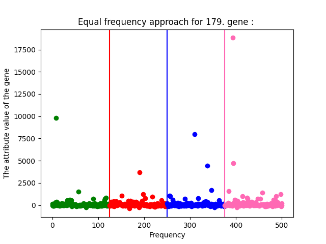

*Figure 16 - The Scatterplot of The Second Random Gene's Equal Frequency Approach*
#### 2\.1.2.5 Codes for Third Random Gene

```
group1_forvalue3_forfrequency = []
group2_forvalue3_forfrequency = []
group3_forvalue3_forfrequency = []
group4_forvalue3_forfrequency = []


for i in range(frequency):
    group1_forvalue3_forfrequency.append(value3[i])
for i in range(frequency,2*frequency):
    group2_forvalue3_forfrequency.append(value3[i])
for i in range(2*frequency,3*frequency):
    group3_forvalue3_forfrequency.append(value3[i])
for i in range(3*frequency,(int(len(value1)))):
    group4_forvalue3_forfrequency.append(value3[i])

print("\n\nEqual frequency approach for {}. gene : ".format(random3))
print("\nThe attributes between {} and {} :".format(0, frequency))
print(group1_forvalue3_forfrequency)
print("\nThe attributes between {} and {} :".format(frequency, frequency*2))
print(group2_forvalue3_forfrequency)
print("\nThe attributes between {} and {} :".format(frequency*2, frequency*3))
print(group3_forvalue3_forfrequency)
print("\nThe attributes between {} and {} :".format(frequency*3, len(value3)))
print(group4_forvalue3_forfrequency)

x3_1 = numpy.arange(0,frequency)
plt.scatter(x3_1, group1_forvalue3_forfrequency, color='g')

x3_2 = numpy.arange(frequency,2*frequency)
plt.scatter(x3_2, group2_forvalue3_forfrequency, color='r')

x3_3 = numpy.arange(2*frequency,3*frequency)
plt.scatter(x3_3, group3_forvalue3_forfrequency, color='b')

x3_4 = numpy.arange(3*frequency,4*frequency+1)
plt.scatter(x3_4, group4_forvalue3_forfrequency, color='hotpink')

plt.axvline(x = frequency, color = 'r')
plt.axvline(x = 2*frequency, color = 'b')
plt.axvline(x = 3*frequency, color = 'hotpink')
plt.title("Equal frequency approach for {}. gene : ".format(random3))
plt.xlabel("Frequency")
plt.ylabel("The attribute value of the gene")

plt.show()
```

*Figure 17 - Third Random Gene's Equal Frequency Approach Process*

#### 2\.1.2.6 Outputs for Third Random Gene

```
Equal frequency approach for 126. gene : 

The attributes between 0 and 125 :
[205.8, 86.9, 52.7, -133.2, 57.6, 2040.1, 510.4, 394.0, 874.2, 683.4, 127.6, 20.9, 258.9, 26.9, 6.3, 70.9, 6.1, 29.0, 33.7, -57.5, 75.4, 3.3, 430.2, 6.7, 12.5, -185.5, -40.1, 27.6, 47.4, 41.6, 59.6, 16.7, 31.9, 298.4, 43.2, 101.5, 30.3, 272.7, 283.2, 20.5, -26.7, 389.8, 400.9, 31.7, 41.7, 69.9, 120.0, 1.0, 55.1, 67.5, 26.1, -4.0, 25.3, -14.9, 89.7, -12.1, -22.0, 1675.0, -5.1, 36.5, 49.1, 13.3, 233.7, -37.3, 11.0, 13.3, 24.7, 64.8, 131.2, 73.1, 53.0, 17.0, -9.2, 141.2, 6.4, 138.6, 62.1, 58.9, 31.6, 117.2, 251.0, 186.9, 12.1, 15.8, -6.0, 1.9, 53.6, -28.9, -32.6, 364.8, 20.8, 943.8, -29.9, 187.0, -16.4, -0.7, -0.7, -40.7, -48.1, 39.3, 43.0, 1.0, 11.7, -26.5, -1.0, 185.2, 101.5, -14.6, -71.3, 73.0, 141.3, 10.4, 64.0, -35.0, 298.3, 294.0, 132.2, 620.9, 4.6, 0.6, 376.6, 82.6, 1.3, 142.6, 182.3]

The attributes between 125 and 250 :
[66.6, 48.0, 105.8, 649.4, 104.5, 221.7, 73.9, 4.8, 11.4, 352.6, -39.9, 56.3, 229.4, 348.2, 241.2, 43.7, 0.6, -11.2, 121.1, 265.2, -14.8, 22.7, 267.9, 99.4, -1.6, 58.9, 450.0, 19.0, 14.9, -34.8, 73.4, 69.2, 45.2, 20.0, 35.2, 73.0, 43.0, 31.4, 7.3, -61.8, 119.5, 582.0, 15.3, 111.0, 100.1, 217.0, 26.4, -0.5, 457.4, 20.3, 89.3, 187.1, 1233.9, 119.3, 35.3, 5.9, 48.2, 398.5, 266.2, -2.5, 26.7, 28.5, 128.6, 55.1, -75.0, 3575.0, -23.1, 41.2, 41.5, 83.6, 3.7, 622.3, 146.8, 1094.4, 28.2, 4.0, 26.3, 400.7, 138.6, -1.4, 19.7, -13.6, 66.1, -6.0, 6.4, 163.8, 66.4, -41.2, -28.9, 4.3, 30.1, 17.5, 26.0, 709.6, -94.3, 20.2, -3.4, 22.8, -70.4, 27.2, 46.2, 70.0, -48.8, -11.2, 115.8, -89.7, 39.4, 15.9, 35.0, -19.2, 27.5, 106.1, -33.5, 460.5, 156.3, 46.7, 0.6, 76.7, 125.8, 111.6, -11.2, -52.3, 110.7, 35.2, -6.3]

The attributes between 250 and 375 :
[8.2, 29.0, 17.8, -104.9, -23.4, 886.1, 10.1, 832.7, 19.8, 3.1, 8.5, 70.3, 525.0, 170.6, 130.7, 211.2, 17.2, 1.4, -28.9, 220.2, 7.5, 43.8, 51.4, 263.5, 54.2, 95.9, 34.3, 34.7, 283.9, 49.0, 122.3, -101.7, 3.7, 14.8, 105.6, 11.9, 21.0, 19.7, 79.2, 703.0, 15.9, -1.0, 257.3, 288.1, 12.8, 157.1, 130.6, 20.9, 198.2, 149.7, 81.8, -17.8, 261.3, -36.9, 22.6, 16.4, 17.9, 7.6, 6.0, 168.6, 12642.2, 77.7, 118.6, 72.6, 96.2, -56.0, -24.5, 188.5, 294.9, 168.2, 23.6, -0.3, -5.5, 129.2, 202.1, 36.7, 13.2, 71.5, 281.3, 44.2, 54.3, 278.7, 113.3, 454.2, 422.7, 374.7, 246.5, 154.7, 3295.4, 65.7, 34.8, 122.6, 56.5, 25.4, -28.5, 52.1, 75.5, 1823.9, 47.5, 106.3, 91.2, 71.6, 22.3, -92.7, -41.8, 41.8, 55.8, 6.6, 36.9, -35.6, 44.0, 56.1, 5.8, 146.3, 545.8, -24.7, 130.4, 8.3, 81.4, 17.2, -26.6, 563.1, 138.1, 17.5, -4.2]

The attributes between 375 and 501 :
[9.9, -7.5, 68.8, -80.8, 58.3, 14.0, 26.9, 136.2, 127.5, 179.4, -16.2, -13.0, 23.5, 81.6, 106.7, 45.3, -19.9, 2.9, 3754.2, 5753.0, 330.3, 161.8, -127.8, 328.4, 447.4, 77.4, 52.3, -278.9, 314.5, 6.4, 126.5, 50.5, 61.4, -45.2, 37.5, 0.5, 23.6, 143.7, 15.3, 783.7, 166.4, -41.7, 78.8, 27.2, 120.5, 111.9, -91.9, 359.6, -6.2, 644.5, 485.6, 795.3, 75.0, 408.1, 320.0, -18.0, 36.9, -61.9, 181.0, 195.7, 8.9, 100.7, 15.2, 21.7, -1.9, 143.8, 200.4, 24.6, 284.5, -26.0, -10.3, -23.4, 267.1, 3.1, 5.9, -49.0, 87.8, -0.1, 1282.2, 1.4, 8.0, 26.6, 912.2, -17.3, 187.2, 95.7, -46.9, -3.2, -29.3, 57.1, 69.6, 86.8, 12.6, 3.5, 16.8, 18.3, 76.3, 178.8, 20.2, 51.4, 17.5, 187.2, 136.7, -13.1, 127.8, 81.5, 203.0, 764.1, 203.5, 169.2, 11.7, 322.0, 935.1, 91.8, 134.3, 105.8, 206.4, 147.3, -125.5, 108.2, 7.7, 104.6, 1294.1, -178.1, 215.1, 0.0]
```

*Figure 18 - Output of The Third Random Gene's Equal Frequency Approach Process*

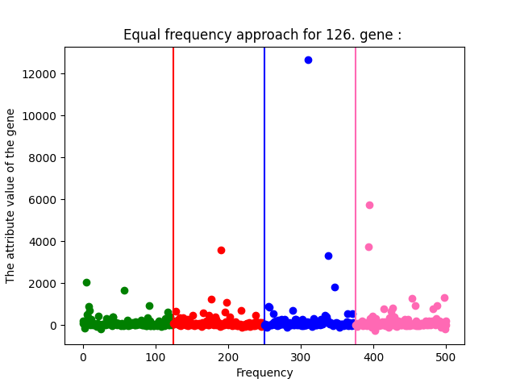

*Figure 19 - The Scatterplot of The Third Random Gene's Equal Frequency Approach*

## **2.2 Attribute Similarity**
Under this heading, we will see The Euclidean Distance, Cosine Similarity and Correlation.
### **2.2.1 The Euclidian Distance**
In general, we can say that it is a value that we find by taking the root of the sum of squares of the differences of the values of two data lists. We can say that the larger the Euclidean distance, the farther these two values are from each other. If this value gets smaller, of course, we can say that these two values are more similar to each other.
#### 2\.2.1.1 Codes for Five Random Genes

```
#Question 2 - Attribute Similarity----------------------------------------------------------
#Part a>i The Euclidian Distance

random4 = random.randint(0,179)
random5 = random.randint(0,179)

value1 = data_list[random1]
value2 = data_list[random2]
value3 = data_list[random3]
value4 = data_list[random2]
value5 = data_list[random3]

#Euclidian Distance Between value1 and value2
answersquare_val1val2 = 0
for i in range(500):
    answersquare_val1val2 += (value1[i]-value2[i])**2

answer_val1val2 = answersquare_val1val2**0.5
answer_val1val2 = round(answer_val1val2,1)
print("\nEuclidian Distance Between {}. gene and {}. gene is : {}".format(random1, random2, answer_val1val2 ))

#Euclidian Distance Between value1 and value3
answersquare_val1val3 = 0
for i in range(500):
    answersquare_val1val3 += (value1[i]-value3[i])**2

answer_val1val3 = answersquare_val1val3**0.5
answer_val1val3 = round(answer_val1val3,1)
print("\nEuclidian Distance Between {}. gene and {}. gene is : {}".format(random1, random3, answer_val1val3 ))


#Euclidian Distance Between value1 and value4
answersquare_val1val4 = 0
for i in range(500):
    answersquare_val1val4 += (value1[i]-value4[i])**2

answer_val1val4 = answersquare_val1val4**0.5
answer_val1val4 = round(answer_val1val4,1)
print("\nEuclidian Distance Between {}. gene and {}. gene is : {}".format(random1, random4, answer_val1val4 ))

#Euclidian Distance Between value1 and value5
answersquare_val1val5 = 0
for i in range(500):
    answersquare_val1val5 += (value1[i]-value5[i])**2

answer_val1val5 = answersquare_val1val5**0.5
answer_val1val5 = round(answer_val1val5,1)
print("\nEuclidian Distance Between {}. gene and {}. gene is : {}".format(random1, random5, answer_val1val5 ))

#Euclidian Distance Between value2 and value3
answersquare_val2val3 = 0
for i in range(500):
    answersquare_val2val3 += (value2[i]-value3[i])**2

answer_val2val3 = answersquare_val2val3**0.5
answer_val2val3 = round(answer_val2val3,1)
print("\nEuclidian Distance Between {}. gene and {}. gene is : {}".format(random2, random3, answer_val2val3 ))

#Euclidian Distance Between value2 and value4
answersquare_val2val4 = 0
for i in range(500):
    answersquare_val2val4 += (value2[i]-value4[i])**2

answer_val2val4 = answersquare_val2val4**0.5
answer_val2val4 = round(answer_val2val4,1)
print("\nEuclidian Distance Between {}. gene and {}. gene is : {}".format(random2, random4, answer_val2val4 ))

#Euclidian Distance Between value2 and value5
answersquare_val2val5 = 0
for i in range(500):
    answersquare_val2val5 += (value2[i]-value5[i])**2

answer_val2val5 = answersquare_val2val5**0.5
answer_val2val5 = round(answer_val2val5,1)
print("\nEuclidian Distance Between {}. gene and {}. gene is : {}".format(random2, random5, answer_val2val5 ))

#Euclidian Distance Between value3 and value4
answersquare_val3val4 = 0
for i in range(500):
    answersquare_val3val4 += (value3[i]-value4[i])**2

answer_val3val4 = answersquare_val3val4**0.5
answer_val3val4 = round(answer_val3val4,1)
print("\nEuclidian Distance Between {}. gene and {}. gene is : {}".format(random3, random4, answer_val3val4 ))

#Euclidian Distance Between value3 and value5
answersquare_val3val5 = 0
for i in range(500):
    answersquare_val3val5 += (value3[i]-value5[i])**2

answer_val3val5 = answersquare_val3val5**0.5
answer_val3val5 = round(answer_val3val5,1)
print("\nEuclidian Distance Between {}. gene and {}. gene is : {}".format(random3, random5, answer_val3val5 ))

#Euclidian Distance Between value4 and value5
answersquare_val4val5 = 0
for i in range(500):
    answersquare_val4val5 += (value4[i]-value5[i])**2

answer_val4val5 = answersquare_val4val5**0.5
answer_val4val5 = round(answer_val4val5,1)
print("\nEuclidian Distance Between {}. gene and {}. gene is : {}".format(random4, random5, answer_val4val5 ))
```
*Figure 20 - The Process of The Euclidian Distance for Five Random Genes*

#### 2\.2.1.2 Outputs for Five Random Genes

```
Euclidian Distance Between 72. gene and 179. gene is : 19255.0

Euclidian Distance Between 72. gene and 126. gene is : 7832.7

Euclidian Distance Between 72. gene and 161. gene is : 19255.0

Euclidian Distance Between 72. gene and 18. gene is : 7832.7

Euclidian Distance Between 179. gene and 126. gene is : 18567.5

Euclidian Distance Between 179. gene and 161. gene is : 0.0

Euclidian Distance Between 179. gene and 18. gene is : 18567.5

Euclidian Distance Between 126. gene and 161. gene is : 18567.5

Euclidian Distance Between 126. gene and 18. gene is : 0.0

Euclidian Distance Between 161. gene and 18. gene is : 18567.5
```

*Figure 21 - The Output of The Five Random Genes' Euclidian Distance*

In the output, some genes have the same or close Euclidian distances. But by looking at this result, we can say that genes 179 and 161 are the same. Also the 126th and 18th genes are the same. In this case, we can say that the most similar genes are the 72th, 126th and 18rd genes. At the same time, it is possible to say that the least similar genes are the 179th and 161th genes.
### **2.2.2 The Cosine Similarity**
The cosine of two non-zero vectors can be derived by using this formula: 

Cos(d1,d2) = (d1 . d2) / ||d1|| . ||d2||

For example, two proportional vectors have a cosine similarity of 1, two orthogonal vectors have a similarity of 0, and two opposite vectors have a similarity of -1.

#### 2\.2.2.1 Codes for Five Random Genes
```
#Part A>II Cosine Similarity-----------------------------------------------------------
#Cosine Similarity Between Value 1 and Value 2
val1_val2_d1d2 = 0
val1_val2_d1d1 = 0
val1_val2_d2d2 = 0
for i in range(500):
    val1_val2_d1d2 += value1[i]*value2[i]
    val1_val2_d1d1 += value1[i]**2
    val1_val2_d2d2 += value2[i]**2

CosSimilarity_val1_val2 = val1_val2_d1d2 / ((val1_val2_d1d1**0.5) *  (val1_val2_d2d2**0.5) )
CosSimilarity_val1_val2 = round(CosSimilarity_val1_val2,1)
print("\nCosine Similarity between {} and {} is : {}".format(random1,random2,CosSimilarity_val1_val2))

    
#Cosine Similarity Between Value 1 and Value 3
val1_val3_d1d2 = 0
val1_val3_d1d1 = 0
val1_val3_d2d2 = 0
for i in range(500):
    val1_val3_d1d2 += value1[i]*value3[i]
    val1_val3_d1d1 += value1[i]**2
    val1_val3_d2d2 += value3[i]**2

CosSimilarity_val1_val3 = val1_val3_d1d2 / ((val1_val3_d1d1**0.5) *  (val1_val3_d2d2**0.5) )
CosSimilarity_val1_val3 = round(CosSimilarity_val1_val3,1)
print("\nCosine Similarity between {} and {} is : {}".format(random1,random3,CosSimilarity_val1_val3))


#Cosine Similarity Between Value 1 and Value 4
val1_val4_d1d2 = 0
val1_val4_d1d1 = 0
val1_val4_d2d2 = 0
for i in range(500):
    val1_val4_d1d2 += value1[i]*value4[i]
    val1_val4_d1d1 += value1[i]**2
    val1_val4_d2d2 += value4[i]**2

CosSimilarity_val1_val4 = val1_val4_d1d2 / ((val1_val4_d1d1**0.5) *  (val1_val4_d2d2**0.5) )
CosSimilarity_val1_val4 = round(CosSimilarity_val1_val4,1)
print("\nCosine Similarity between {} and {} is : {}".format(random1,random4,CosSimilarity_val1_val4))


#Cosine Similarity Between Value 1 and Value 5
val1_val5_d1d2 = 0
val1_val5_d1d1 = 0
val1_val5_d2d2 = 0
for i in range(500):
    val1_val5_d1d2 += value1[i]*value5[i]
    val1_val5_d1d1 += value1[i]**2
    val1_val5_d2d2 += value5[i]**2

CosSimilarity_val1_val5 = val1_val5_d1d2 / ((val1_val5_d1d1**0.5) *  (val1_val5_d2d2**0.5) )
CosSimilarity_val1_val5 = round(CosSimilarity_val1_val5,1)
print("\nCosine Similarity between {} and {} is : {}".format(random1,random5,CosSimilarity_val1_val5))


#Cosine Similarity Between Value 2 and Value 3
val2_val3_d1d2 = 0
val2_val3_d1d1 = 0
val2_val3_d2d2 = 0
for i in range(500):
    val2_val3_d1d2 += value2[i]*value3[i]
    val2_val3_d1d1 += value2[i]**2
    val2_val3_d2d2 += value3[i]**2

CosSimilarity_val2_val3 = val2_val3_d1d2 / ((val2_val3_d1d1**0.5) *  (val2_val3_d2d2**0.5) )
CosSimilarity_val2_val3 = round(CosSimilarity_val2_val3,1)
print("\nCosine Similarity between {} and {} is : {}".format(random2,random3,CosSimilarity_val2_val3))

#Cosine Similarity Between Value 2 and Value 4
val2_val4_d1d2 = 0
val2_val4_d1d1 = 0
val2_val4_d2d2 = 0
for i in range(500):
    val2_val4_d1d2 += value2[i]*value4[i]
    val2_val4_d1d1 += value2[i]**2
    val2_val4_d2d2 += value4[i]**2

CosSimilarity_val2_val4 = val2_val4_d1d2 / ((val2_val4_d1d1**0.5) *  (val2_val4_d2d2**0.5) )
CosSimilarity_val2_val4 = round(CosSimilarity_val2_val4,1)
print("\nCosine Similarity between {} and {} is : {}".format(random2,random4,CosSimilarity_val2_val4))

#Cosine Similarity Between Value 2 and Value 5
val2_val5_d1d2 = 0
val2_val5_d1d1 = 0
val2_val5_d2d2 = 0
for i in range(500):
    val2_val5_d1d2 += value2[i]*value4[i]
    val2_val5_d1d1 += value2[i]**2
    val2_val5_d2d2 += value4[i]**2

CosSimilarity_val2_val5 = val2_val5_d1d2 / ((val2_val5_d1d1**0.5) *  (val2_val5_d2d2**0.5) )
CosSimilarity_val2_val5 = round(CosSimilarity_val2_val5,1)
print("\nCosine Similarity between {} and {} is : {}".format(random2,random5,CosSimilarity_val2_val5))


#Cosine Similarity Between Value 3 and Value 4
val3_val4_d1d2 = 0
val3_val4_d1d1 = 0
val3_val4_d2d2 = 0
for i in range(500):
    val3_val4_d1d2 += value3[i]*value4[i]
    val3_val4_d1d1 += value3[i]**2
    val3_val4_d2d2 += value4[i]**2

CosSimilarity_val3_val4 = val3_val4_d1d2 / ((val3_val4_d1d1**0.5) *  (val3_val4_d2d2**0.5) )
CosSimilarity_val3_val4 = round(CosSimilarity_val3_val4,1)
print("\nCosine Similarity between {} and {} is : {}".format(random3,random4,CosSimilarity_val3_val4))

#Cosine Similarity Between Value 3 and Value 5
val3_val5_d1d2 = 0
val3_val5_d1d1 = 0
val3_val5_d2d2 = 0
for i in range(500):
    val3_val5_d1d2 += value3[i]*value5[i]
    val3_val5_d1d1 += value3[i]**2
    val3_val5_d2d2 += value5[i]**2

CosSimilarity_val3_val5 = val3_val5_d1d2 / ((val3_val5_d1d1**0.5) *  (val3_val5_d2d2**0.5) )
CosSimilarity_val3_val5 = round(CosSimilarity_val3_val5,1)
print("\nCosine Similarity between {} and {} is : {}".format(random3,random5,CosSimilarity_val3_val5))

#Cosine Similarity Between Value 4 and Value 5
val4_val5_d1d2 = 0
val4_val5_d1d1 = 0
val4_val5_d2d2 = 0
for i in range(500):
    val4_val5_d1d2 += value4[i]*value5[i]
    val4_val5_d1d1 += value4[i]**2
    val4_val5_d2d2 += value5[i]**2

CosSimilarity_val4_val5 = val4_val5_d1d2 / ((val4_val5_d1d1**0.5) *  (val4_val5_d2d2**0.5) )
CosSimilarity_val4_val5 = round(CosSimilarity_val4_val5,1)
print("\nCosine Similarity between {} and {} is : {}".format(random4,random5,CosSimilarity_val4_val5))
```

*Figure 22 - The Process of The Cosine Similarity for Five Random Genes*

#### 2\.2.2.2 Outputs for Five Random Genes
```
Cosine Similarity

Cosine Similarity between 72 and 179 is : 0.7

Cosine Similarity between 72 and 126 is : 0.9

Cosine Similarity between 72 and 161 is : 0.7

Cosine Similarity between 72 and 18 is : 0.9

Cosine Similarity between 179 and 126 is : 0.7

Cosine Similarity between 179 and 161 is : 1.0

Cosine Similarity between 179 and 18 is : 1.0

Cosine Similarity between 126 and 161 is : 0.7

Cosine Similarity between 126 and 18 is : 1.0

Cosine Similarity between 161 and 18 is : 0.7
```
*Figure 23 - The Output of The Five Random Genes' Cosine Similarity*

Since we use the same randomly selected genes in all processes, we can see the benefit of comparing different methods under the same heading.

Based on Figure 21, we observed that gene 179 and gene 161 were the same but very different from the other three. . Now we see that the cosine similarity largely confirms the previous data. However, although the 126th gene and the 18th gene are the same, the 179th gene is the same as the 18th gene but has a distant relationship with the 126th gene. I expected about 0.7 cosine similarity between the 179th gen and the 18th gen. But the value I got surprised me.

### **2.2.3 The Correlation**
Correlation analysis is a statistical method used to measure the strength of the linear relationship between two variables and compute their association. Correlation analysis calculates the level of change in one variable due to the change in the other. A high correlation points to a strong relationship between the two variables, while a low correlation means that the variables are weakly related [5].
#### 2\.2.3.1 Codes for Correlation with Five Random Genes
```
#Part A>III Correlation-----------------------------------------------------------


totalForVal1 = 0
totalForVal2 = 0
totalForVal3 = 0
totalForVal4 = 0
totalForVal5 = 0

n = len(value1)

for i in range(500):
    totalForVal1+= value1[i]
    totalForVal2+= value2[i]
    totalForVal3+= value3[i]
    totalForVal4+= value4[i]
    totalForVal5+= value5[i]

meanForVal1 = totalForVal1 / n
meanForVal2 = totalForVal2 / n
meanForVal3 = totalForVal3 / n
meanForVal4 = totalForVal4 / n
meanForVal5 = totalForVal5 / n

#The sum of the squares of the differences
total_val1 = 0
total_val2 = 0
total_val3 = 0
total_val4 = 0
total_val5 = 0

for i in range(500):
    total_val1 += (value1[i]-meanForVal1)**2
    total_val2 += (value2[i]-meanForVal2)**2
    total_val3 += (value3[i]-meanForVal3)**2
    total_val4 += (value4[i]-meanForVal4)**2
    total_val5 += (value5[i]-meanForVal5)**2


std_val1 =( 1/(n-1)* total_val1 ) **2
std_val2 =( 1/(n-1)* total_val2 ) **2
std_val3 =( 1/(n-1)* total_val3 ) **2
std_val4 =( 1/(n-1)* total_val4 ) **2
std_val5 =( 1/(n-1)* total_val5 ) **2

#p' of p
value1__ = []
value2__ = []
value3__ = []
value4__ = []
value5__ = []
for i in range(500):
    value1__.append((value1[i]-meanForVal1 )/std_val1)
    value2__.append((value2[i]-meanForVal2 )/std_val2)
    value3__.append((value3[i]-meanForVal3 )/std_val3)
    value4__.append((value4[i]-meanForVal4 )/std_val4)
    value5__.append((value5[i]-meanForVal5 )/std_val5)


#Correlation Between Value x' and Value y'
corBet_Val1andVal2 = 0
corBet_Val1andVal3 = 0
corBet_Val1andVal4 = 0
corBet_Val1andVal5 = 0
corBet_Val2andVal3 = 0
corBet_Val2andVal4 = 0
corBet_Val2andVal5 = 0
corBet_Val3andVal4 = 0
corBet_Val3andVal5 = 0
corBet_Val4andVal5 = 0
for i in range(500):
    corBet_Val1andVal2 += value1__[i]*value2__[i]
    corBet_Val1andVal3 += value1__[i]*value3__[i]
    corBet_Val1andVal4 += value1__[i]*value4__[i]
    corBet_Val1andVal5 += value1__[i]*value5__[i]
    corBet_Val2andVal3 += value2__[i]*value3__[i]
    corBet_Val2andVal4 += value2__[i]*value4__[i]
    corBet_Val2andVal5 += value2__[i]*value5__[i]
    corBet_Val3andVal4 += value3__[i]*value4__[i]
    corBet_Val3andVal5 += value3__[i]*value5__[i]
    corBet_Val4andVal5 += value4__[i]*value5__[i]


print("\n\n\nCorrelation Between {} and {} is : {}".format(random1,random2, corBet_Val1andVal2))
print("\nCorrelation Between {} and {} is : {}".format(random1,random3, corBet_Val1andVal3))
print("\nCorrelation Between {} and {} is : {}".format(random1,random4, corBet_Val1andVal4))
print("\nCorrelation Between {} and {} is : {}".format(random1,random5, corBet_Val1andVal5))
print("\nCorrelation Between {} and {} is : {}".format(random2,random3, corBet_Val2andVal3))
print("\nCorrelation Between {} and {} is : {}".format(random2,random4, corBet_Val2andVal4))
print("\nCorrelation Between {} and {} is : {}".format(random2,random5, corBet_Val2andVal5))
print("\nCorrelation Between {} and {} is : {}".format(random3,random4, corBet_Val3andVal4))
print("\nCorrelation Between {} and {} is : {}".format(random3,random5, corBet_Val3andVal5))
print("\nCorrelation Between {} and {} is : {}".format(random4,random5, corBet_Val4andVal5))
```

*Figure 24 - The Process of The Correlation for Five Random Genes*


#### 2\.2.3.2 Outputs for Correlation with Five Random Genes

```
Correlation Between 72 and 179 is : 2.734229784397608e-15

Correlation Between 72 and 126 is : 1.366364231780023e-14

Correlation Between 72 and 161 is : 2.734229784397608e-15

Correlation Between 72 and 18 is : 1.366364231780023e-14

Correlation Between 179 and 126 is : 7.126178743382514e-16

Correlation Between 179 and 161 is : 3.121216991025851e-16

Correlation Between 179 and 18 is : 7.126178743382514e-16

Correlation Between 126 and 161 is : 7.126178743382514e-16

Correlation Between 126 and 18 is : 3.953451270883555e-15

Correlation Between 161 and 18 is : 7.126178743382514e-16
```

*Figure 25 - The Output of The Five Random Genes' Correlation*

When we look at the correlation values of genes with each other, it would not be wrong to say that all genes have a similarity. However, we can say that the 72nd gen is the least similar. When we compared the 179th gene with the 161st gene with other results, I observed that these two genes were not the same in these results. I also see that the affinity of the 179th gene with the 18th and 126th genes is the same as the 161st gene's affinity with the 18th and 126th genes.

## **2.3 Min-Max Normalization**
```
#Question 2 >Part B>Min - Max Normalization-----------------------------------------------------------
Normalized_data_list = [[0 for _ in range(500)] for _ in range(180)]

for i in range(180):
    num_of_positive=0
    num_of_negative=0
    for j in range(500):
        if (data_list[i][j] > 0):
            num_of_positive +=1
        if (data_list[i][j] < 0):
            num_of_negative +=1
    value = data_list[i]
    if (num_of_positive > 0 and num_of_negative>0):
        for k in range(500):
            z = (value[k]-min(value))/ (max(value)-min(value))*(1-(-1))+(-1)
            z= round(z,1)
            Normalized_data_list[i][k] = z

    elif (num_of_positive > 0 and num_of_negative ==0):
        for k in range(500):
            z = (value[k]-min(value))/ (max(value)-min(value))*(1-0)+(0)
            z= round(z,1)
            Normalized_data_list[i][k] = z
    else:
        for k in range(500):
            z = (value[k]-min(value))/ (max(value)-min(value))*(0-(-1))+(-1)
            z= round(z,1)
            Normalized_data_list[i][k] = z

```

*Figure 26 - The Process of The Normalization of All Genes in Data*

In this study, we applied normalization to all data and created our new data set by applying different processes regarding whether the data contains positive or negative values, as requested. Now, we will apply all the operations we have applied before under this heading to this new data set.
### **2.3.1 Equal Width Approach for Normalized Data**
In fact, we will only apply the operations we applied in 2.1.1 to the normalized version of the same data and compare the studies. 
#### 2\.3.1.1 Codes for First Random Gene
```
#Discretization for Normalized Data
#Question2>B>-----------------------------------------------------------------------------
#Calculating width for 4 different groups

value1_N = Normalized_data_list[random1]
value2_N = Normalized_data_list[random2]
value3_N = Normalized_data_list[random3]

#Calculating the width for normalized data
width_N = (max(value1_N)-min(value1_N))/4
width_N =  round(width_N,1)
print("\n\nCalculating the width for normalized data : ")
print("\nWidth :", width_N)

#Calculating the borders
firstline_N = min(value1_N)+width_N
secondline_N = min(value1_N)+width_N+width_N
thirdline_N = min(value1_N)+width_N+width_N+width_N

firstline_N = round(firstline_N,1)
secondline_N = round(secondline_N,1)
thirdline_N = round(thirdline_N,1)

group1forvalue1_N = []
group2forvalue1_N = []
group3forvalue1_N = []
group4forvalue1_N = []

#Placing the values to the groups for value 1 list
for i in range(500):
    if (value1_N[i]< firstline_N):
        group1forvalue1_N.append(value1_N[i])
        
    elif (value1_N[i]<secondline_N):
        group2forvalue1_N.append(value1_N[i])

    elif (value1_N[i]<thirdline_N):
        group3forvalue1_N.append(value1_N[i])
    else:
        group4forvalue1_N.append(value1_N[i])
print("Equal width approach for {}. gene for normalized data:  ".format(random1))

print("\nThe attributes between {} and {} :".format(min(value1_N), firstline_N))
print(group1forvalue1_N)
print("\nThe attributes between {} and {} :".format(firstline_N, secondline_N))
print(group2forvalue1_N)
print("\nThe attributes between {} and {} :".format(secondline_N, thirdline_N))
print(group3forvalue1_N)
print("\nThe attributes between {} and {} :".format(thirdline_N, max(value1_N)))
print(group4forvalue1_N)

if(len(group1forvalue1_N)>0):
    x_axis1_1_N = numpy.linspace(min(group1forvalue1_N), max(group1forvalue1_N),len(group1forvalue1_N))
    plt.scatter(x_axis1_1_N, group1forvalue1_N, color='g')

if(len(group2forvalue1_N)>0):
    x_axis2_1_N = numpy.linspace(min(group2forvalue1_N), max(group2forvalue1_N),len(group2forvalue1_N))
    plt.scatter(x_axis2_1_N , group2forvalue1_N, color='r')

if(len(group3forvalue1_N)>0):
    x_axis3_1_N = numpy.linspace(min(group3forvalue1_N), max(group3forvalue1_N),len(group3forvalue1_N))
    plt.scatter(x_axis3_1_N, group3forvalue1_N, color='b')

if(len(group4forvalue1_N)>0):
    x_axis4_1_N = numpy.linspace(min(group4forvalue1_N), max(group4forvalue1_N),len(group4forvalue1_N))
    plt.scatter(x_axis4_1_N, group4forvalue1_N, color='hotpink')
   

plt.axvline(x = firstline_N, color = 'r')
plt.axvline(x = secondline_N, color = 'b')
plt.axvline(x = thirdline_N, color = 'hotpink')
plt.title("Equal width approach for {}. gene for normalized data: ".format(random1))
plt.xlabel("Width")
plt.ylabel("The attribute value of the gene")
plt.show()
```

*Figure 27 - First Random Gene's Equal Width Approach Process for Normalized Data*

#### 2\.3.1.2 Outputs for First Random Gene

```
Calculating the width for normalized data : 

Width : 0.5
Equal width approach for 72. gene for normalized data:  

The attributes between -1.0 and -0.5 :
[-0.7, -0.8, -0.8, -0.9, -0.8, -0.8, -0.7, -0.7, -0.8, -0.8, -0.8, -0.8, -0.8, -0.8, -0.9, -0.8, -0.8, -0.8, -0.8, -0.8, -0.8, -0.8, -0.9, -0.8, -0.8, -0.8, -0.8, -0.8, -0.8, -0.8, -0.6, -0.8, -0.8, -0.8, -0.7, -0.7, -0.8, -0.8, -0.8, -0.7, -0.8, -0.8, -0.8, -0.8, -0.8, -0.8, -0.8, -0.8, -0.8, -0.8, -0.8, -0.8, -0.8, -0.8, -0.6, -0.8, -0.8, -0.8, -0.8, -0.8, -0.8, -0.8, -0.8, -0.8, -0.8, -0.8, -0.8, -0.8, -0.8, -0.9, -0.8, -0.9, -0.8, -0.8, -0.8, -0.9, -0.8, -0.7, -0.8, -0.8, -0.8, -0.8, -0.8, -0.8, -0.8, -0.9, -0.6, -0.8, -0.8, -0.8, -0.8, -0.8, -0.8, -0.8, -0.9, -0.9, -0.8, -0.8, -0.8, -0.8, -0.9, -0.8, -0.8, -0.8, -0.8, -0.9, -0.8, -0.8, -0.9, -0.8, -0.8, -0.7, -0.7, -0.7, -0.7, -0.8, -0.8, -0.8, -0.8, -0.8, -0.8, -0.8, -0.8, -0.8, -0.8, -0.7, -0.8, -0.8, -0.8, -0.8, -0.8, -0.7, -0.9, -0.8, -0.8, -0.8, -0.8, -0.8, -0.9, -0.8, -0.7, -0.8, -0.8, -0.8, -0.8, -0.8, -0.8, -0.8, -0.7, -0.8, -0.8, -0.8, -0.8, -0.8, -0.8, -0.8, -0.8, -0.8, -0.8, -0.8, -0.8, -0.8, -0.8, -0.7, -0.8, -0.8, -0.8, -0.8, -0.8, -0.8, -0.7, -0.8, -0.8, -0.7, -0.8, -0.8, -0.8, -0.8, -0.6, -0.8, -0.8, -0.8, -0.8, -0.8, -0.8, -0.8, -0.8, -0.8, -0.8, -0.8, -0.8, -0.6, -0.8, -0.8, -0.8, -0.8, -0.8, -0.8, -0.8, -0.8, -0.8, -0.8, -0.8, -0.7, -0.8, -0.9, -0.8, -0.8, -0.8, -0.8, -0.8, -0.8, -0.8, -0.8, -0.8, -0.9, -0.8, -0.8, -0.8, -0.9, -0.8, -0.8, -0.9, -0.8, -0.8, -0.8, -0.8, -0.8, -0.8, -0.9, -0.6, -0.8, -0.8, -0.8, -0.8, -0.8, -0.8, -0.8, -0.9, -0.8, -0.8, -0.9, -0.8, -0.8, -0.8, -0.9, -0.8, -0.8, -0.6, -0.8, -0.8, -0.8, -0.8, -0.7, -0.8, -0.8, -0.8, -0.8, -0.8, -0.9, -0.7, -0.8, -0.8, -0.9, -0.8, -0.8, -0.8, -0.8, -0.8, -0.8, -0.8, -0.8, -0.9, -0.8, -0.8, -0.8, -0.8, -0.8, -0.8, -0.8, -0.6, -0.8, -0.8, -0.8, -0.8, -0.8, -0.8, -0.8, -0.8, -0.8, -0.8, -0.8, -0.8, -0.8, -0.8, -0.8, -0.8, -0.9, -0.8, -0.8, -0.8, -0.8, -0.8, -0.8, -0.8, -0.8, -0.8, -0.8, -0.7, -0.8, -0.9, -0.8, -0.8, -0.8, -0.8, -0.8, -0.8, -0.8, -0.7, -0.8, -0.8, -0.7, -0.9, -0.6, -0.7, -0.7, -0.7, -0.7, -0.8, -0.8, -0.8, -0.8, -0.8, -0.8, -0.8, -0.8, -0.8, -0.8, -0.8, -0.8, -0.8, -0.9, -0.9, -0.8, -0.8, -0.9, -0.9, -0.9, -0.8, -0.8, -0.8, -0.8, -0.8, -0.8, -0.8, -0.8, -0.9, -0.8, -0.7, -0.8, -0.8, -0.8, -0.8, -0.8, -0.8, -0.9, -0.8, -0.8, -0.8, -0.8, -0.8, -0.8, -0.8, -0.8, -0.8, -0.8, -0.8, -0.8, -0.8, -0.8, -0.8, -0.8, -0.9, -0.8, -0.8, -0.8, -0.8, -1.0, -0.8, -0.8, -0.8, -0.8, -0.8, -0.8, -0.8, -0.8, -0.8, -0.8, -0.8, -0.8, -0.9, -0.8, -0.8, -0.8, -0.8, -0.9, -0.8, -0.8, -0.6, -0.7, -0.6, -0.8, -0.7, -0.7, -0.8, -0.8, -0.8, -0.8, -0.7, -0.8, -0.8, -0.8, -0.8, -0.8, -0.8, -0.8, -0.8, -0.8, -0.8, -0.8, -0.9, -0.8, -0.8, -0.8, -0.8, -0.8, -0.8, -0.8, -0.8, -0.8, -0.8, -0.8, -0.8, -0.8, -0.8, -0.8, -0.8, -0.8, -0.8, -0.8, -0.8, -0.8, -0.8, -0.8, -0.8, -0.8, -0.8, -0.8, -0.8, -0.8, -0.8, -0.8, -0.8, -0.8, -0.7, -0.7, -0.8, -0.6, -0.8, -0.8, -0.8, -0.8, -0.8, -0.8, -0.8, -0.8, -0.8, -0.7, -0.9, -0.8]

The attributes between -0.5 and 0.0 :
[-0.5, -0.5, -0.5, -0.3, -0.4, -0.5, -0.4, -0.3, -0.2, -0.5, -0.5, -0.4, -0.4, -0.5, -0.5]

The attributes between 0.0 and 0.5 :
[0.0, 0.1, 0.0, 0.4]

The attributes between 0.5 and 1.0 :
[1.0]
```

*Figure 28 - Output of The First Random Gene's Equal Width Approach Process for Normalized Data*

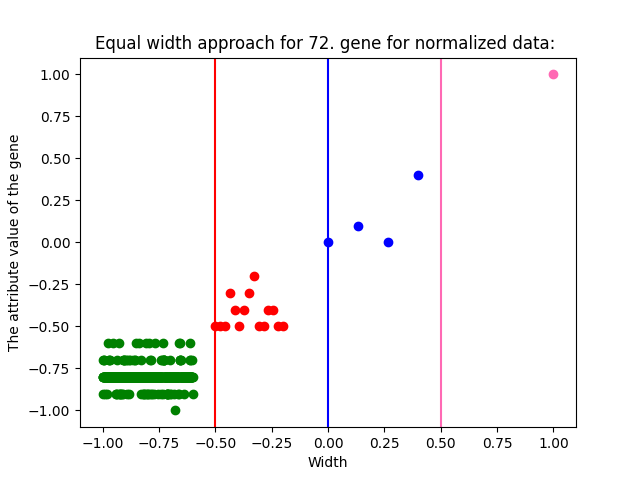

*Figure 29 - The Scatterplot of The First Random Gene's Equal Width Approach for Normalized Data*
#### 2\.3.1.3 Codes for Second Random Gene
```
#------------------------------------------------------------
#Calculating the width for normalized data
width2_N = (max(value2_N)-min(value2_N))/4
width2_N = round(width2_N,1)
print("\n\nCalculating the width for normalized data : ")
print("\nWidth :", width2_N)
print(value2_N)
#Calculating the borders
firstline2_N = min(value2_N)+width2_N
secondline2_N = min(value2_N)+width2_N+width2_N
thirdline2_N = min(value2_N)+width2_N+width2_N+width2_N

firstline2_N = round(firstline2_N,1)
secondline2_N = round(secondline2_N,1)
thirdline2_N = round(thirdline2_N,1)

group1forvalue2_N = []
group2forvalue2_N = []
group3forvalue2_N = []
group4forvalue2_N = []

#Placing the values to the groups for value 2 list
for i in range(500):
    if (value2_N[i]< firstline2_N):
        group1forvalue2_N.append(value2_N[i])
        
    elif (value2_N[i]<secondline2_N):
        group2forvalue2_N.append(value2_N[i])

    elif (value2_N[i]<thirdline2):
        group3forvalue2_N.append(value2_N[i])
    else:
        group4forvalue2_N.append(value2_N[i])

print("Equal width approach for {}. gene for normalized data: ".format(random2))
print("\nThe attributes between {} and {} :".format(min(value2_N), firstline2_N))
print(group1forvalue2_N)
print("\nThe attributes between {} and {} :".format(firstline2_N, secondline2_N))
print(group2forvalue2_N)
print("\nThe attributes between {} and {} :".format(secondline2_N, thirdline2_N))
print(group3forvalue2_N)
print("\nThe attributes between {} and {} :".format(thirdline2_N, max(value2_N)))
print(group4forvalue2_N)


if(len(group1forvalue2_N)>0):
    x_axis1_2_N = numpy.linspace(min(group1forvalue2_N), max(group1forvalue2_N),len(group1forvalue2_N))
    plt.scatter(x_axis1_2_N, group1forvalue2_N, color='g')

if(len(group2forvalue2_N)>0):
    x_axis2_2_N = numpy.linspace(min(group2forvalue2_N), max(group2forvalue2_N),len(group2forvalue2_N))
    plt.scatter(x_axis2_2_N, group2forvalue2_N, color='r')

if(len(group3forvalue2_N)>0):
    x_axis3_2_N = numpy.linspace(min(group3forvalue2_N), max(group3forvalue2_N),len(group3forvalue2_N))
    plt.scatter(x_axis3_2_N, group3forvalue2_N, color='b')

if(len(group4forvalue2_N)>0):
    x_axis4_2_N = numpy.linspace(min(group4forvalue2_N), max(group4forvalue2_N),len(group4forvalue2_N))
    plt.scatter(x_axis4_2_N, group4forvalue2_N, color='hotpink')

plt.axvline(x = firstline2_N, color = 'r')
plt.axvline(x = secondline2_N, color = 'b')
plt.axvline(x = thirdline2_N, color = 'hotpink')
plt.title("Equal width approach for {}. gene for normalized data:  ".format(random2))
plt.xlabel("Width")
plt.ylabel("The attribute value of the gene")

plt.show()
```

*Figure 30 - Second Random Gene's Equal Width Approach Process for Normalized Data*

#### 2\.3.1.4 Outputs for Second Random Gene

```
Calculating the width for normalized data : 

Width : 0.5
[-0.9, -1.0, -1.0, -1.0, -1.0, -0.9, -0.9, -0.9, 0.1, -0.9, -0.9, -1.0, -0.9, -1.0, -1.0, -0.9, -1.0, -1.0, -0.9, -1.0, -0.9, -1.0, -0.9, -1.0, -1.0, -1.0, -1.0, -1.0, -1.0, -0.9, -0.9, -1.0, -0.9, -0.9, -1.0, -0.9, -1.0, -0.9, -0.9, -1.0, -0.9, -0.9, -0.9, -1.0, -1.0, -1.0, -1.0, -1.0, -0.9, -1.0, -1.0, -1.0, -1.0, -1.0, -1.0, -1.0, -1.0, -0.8, -1.0, -1.0, -1.0, -1.0, -1.0, -1.0, -1.0, -1.0, -1.0, -1.0, -0.9, -1.0, -1.0, -1.0, -0.9, -0.9, -1.0, -0.9, -1.0, -1.0, -1.0, -1.0, -0.9, -1.0, -1.0, -1.0, -1.0, -1.0, -1.0, -0.9, -1.0, -0.9, -0.9, -0.9, -1.0, -0.9, -1.0, -1.0, -1.0, -1.0, -1.0, -1.0, -0.9, -1.0, -1.0, -1.0, -1.0, -0.9, -0.9, -1.0, -1.0, -1.0, -0.9, -0.9, -1.0, -1.0, -0.9, -0.9, -0.9, -0.9, -1.0, -1.0, -0.9, -0.9, -0.9, -1.0, -1.0, -1.0, -1.0, -0.9, -0.9, -0.9, -0.9, -1.0, -0.9, -1.0, -0.9, -1.0, -1.0, -0.9, -0.9, -0.9, -0.9, -1.0, -1.0, -0.9, -0.9, -1.0, -0.9, -0.9, -0.9, -1.0, -0.9, -0.8, -1.0, -1.0, -1.0, -1.0, -0.9, -1.0, -0.9, -1.0, -1.0, -1.0, -0.9, -1.0, -1.0, -0.9, -0.9, -1.0, -1.0, -1.0, -0.9, -1.0, -1.0, -0.9, -1.0, -1.0, -1.0, -0.9, -1.0, -1.0, -1.0, -1.0, -0.9, -0.9, -1.0, -1.0, -1.0, -0.9, -1.0, -1.0, -0.6, -1.0, -1.0, -1.0, -1.0, -1.0, -0.9, -1.0, -0.8, -1.0, -1.0, -0.9, -0.9, -0.9, -1.0, -1.0, -1.0, -1.0, -1.0, -1.0, -1.0, -1.0, -1.0, -1.0, -1.0, -1.0, -1.0, -1.0, -0.9, -1.0, -1.0, -1.0, -0.9, -1.0, -1.0, -1.0, -1.0, -1.0, -1.0, -0.9, -1.0, -1.0, -1.0, -1.0, -1.0, -1.0, -1.0, -1.0, -0.9, -0.9, -0.9, -1.0, -1.0, -0.9, -0.9, -1.0, -1.0, -1.0, -1.0, -1.0, -0.9, -1.0, -1.0, -1.0, -1.0, -0.9, -1.0, -0.9, -0.9, -1.0, -1.0, -0.9, -0.9, -1.0, -0.9, -0.9, -1.0, -1.0, -1.0, -0.9, -1.0, -1.0, -1.0, -0.9, -1.0, -0.9, -1.0, -1.0, -0.9, -1.0, -1.0, -1.0, -0.9, -1.0, -1.0, -1.0, -1.0, -1.0, -1.0, -0.9, -0.9, -1.0, -0.9, -0.9, -1.0, -1.0, -0.9, -1.0, -1.0, -0.9, -1.0, -1.0, -0.9, -1.0, -1.0, -1.0, -1.0, -1.0, -1.0, -1.0, -0.1, -1.0, -0.9, -0.9, -1.0, -1.0, -1.0, -0.9, -0.9, -0.9, -1.0, -1.0, -1.0, -1.0, -0.9, -0.9, -1.0, -0.9, -0.9, -1.0, -0.9, -0.9, -1.0, -0.9, -0.9, -0.9, -0.9, -0.9, -0.5, -0.9, -1.0, -1.0, -1.0, -1.0, -1.0, -1.0, -0.9, -0.8, -1.0, -1.0, -1.0, -0.9, -1.0, -1.0, -1.0, -0.9, -0.9, -1.0, -1.0, -1.0, -1.0, -1.0, -1.0, -0.9, -0.9, -1.0, -1.0, -1.0, -1.0, -1.0, -1.0, -1.0, -0.9, -1.0, -1.0, -1.0, -1.0, -1.0, -1.0, -1.0, -1.0, -1.0, -0.9, -0.9, -0.8, -1.0, -1.0, -1.0, -0.9, -1.0, -1.0, -1.0, -1.0, 1.0, -0.5, -0.9, -1.0, -1.0, -0.9, -1.0, -1.0, -1.0, -1.0, -0.9, -1.0, -0.9, -1.0, -0.9, -1.0, -1.0, -1.0, -1.0, -0.9, -0.9, -0.9, -0.9, -1.0, -0.9, -0.9, -1.0, -0.9, -1.0, -0.9, -1.0, -0.9, -0.9, -0.9, -0.9, -0.9, -0.9, -1.0, -1.0, -0.9, -0.9, -0.9, -1.0, -0.9, -0.9, -1.0, -1.0, -0.9, -0.9, -1.0, -0.9, -1.0, -1.0, -1.0, -0.9, -1.0, -1.0, -1.0, -1.0, -1.0, -0.9, -1.0, -1.0, -1.0, -0.8, -1.0, -0.9, -0.9, -1.0, -1.0, -1.0, -0.9, -1.0, -1.0, -0.9, -1.0, -1.0, -1.0, -1.0, -1.0, -1.0, -1.0, -1.0, -0.9, -0.9, -1.0, -1.0, -0.9, -0.9, -0.9, -1.0, -0.9, -1.0, -0.9, -0.9, -1.0, -1.0, -0.9, -0.9, -1.0, -1.0, -1.0, -1.0, -1.0, -0.8, -1.0, -0.9]

Equal width approach for 179. gene for normalized data: 

The attributes between -1.0 and -0.5 :
[-0.9, -1.0, -1.0, -1.0, -1.0, -0.9, -0.9, -0.9, -0.9, -0.9, -1.0, -0.9, -1.0, -1.0, -0.9, -1.0, -1.0, -0.9, -1.0, -0.9, -1.0, -0.9, -1.0, -1.0, -1.0, -1.0, -1.0, -1.0, -0.9, -0.9, -1.0, -0.9, -0.9, -1.0, -0.9, -1.0, -0.9, -0.9, -1.0, -0.9, -0.9, -0.9, -1.0, -1.0, -1.0, -1.0, -1.0, -0.9, -1.0, -1.0, -1.0, -1.0, -1.0, -1.0, -1.0, -1.0, -0.8, -1.0, -1.0, -1.0, -1.0, -1.0, -1.0, -1.0, -1.0, -1.0, -1.0, -0.9, -1.0, -1.0, -1.0, -0.9, -0.9, -1.0, -0.9, -1.0, -1.0, -1.0, -1.0, -0.9, -1.0, -1.0, -1.0, -1.0, -1.0, -1.0, -0.9, -1.0, -0.9, -0.9, -0.9, -1.0, -0.9, -1.0, -1.0, -1.0, -1.0, -1.0, -1.0, -0.9, -1.0, -1.0, -1.0, -1.0, -0.9, -0.9, -1.0, -1.0, -1.0, -0.9, -0.9, -1.0, -1.0, -0.9, -0.9, -0.9, -0.9, -1.0, -1.0, -0.9, -0.9, -0.9, -1.0, -1.0, -1.0, -1.0, -0.9, -0.9, -0.9, -0.9, -1.0, -0.9, -1.0, -0.9, -1.0, -1.0, -0.9, -0.9, -0.9, -0.9, -1.0, -1.0, -0.9, -0.9, -1.0, -0.9, -0.9, -0.9, -1.0, -0.9, -0.8, -1.0, -1.0, -1.0, -1.0, -0.9, -1.0, -0.9, -1.0, -1.0, -1.0, -0.9, -1.0, -1.0, -0.9, -0.9, -1.0, -1.0, -1.0, -0.9, -1.0, -1.0, -0.9, -1.0, -1.0, -1.0, -0.9, -1.0, -1.0, -1.0, -1.0, -0.9, -0.9, -1.0, -1.0, -1.0, -0.9, -1.0, -1.0, -0.6, -1.0, -1.0, -1.0, -1.0, -1.0, -0.9, -1.0, -0.8, -1.0, -1.0, -0.9, -0.9, -0.9, -1.0, -1.0, -1.0, -1.0, -1.0, -1.0, -1.0, -1.0, -1.0, -1.0, -1.0, -1.0, -1.0, -1.0, -0.9, -1.0, -1.0, -1.0, -0.9, -1.0, -1.0, -1.0, -1.0, -1.0, -1.0, -0.9, -1.0, -1.0, -1.0, -1.0, -1.0, -1.0, -1.0, -1.0, -0.9, -0.9, -0.9, -1.0, -1.0, -0.9, -0.9, -1.0, -1.0, -1.0, -1.0, -1.0, -0.9, -1.0, -1.0, -1.0, -1.0, -0.9, -1.0, -0.9, -0.9, -1.0, -1.0, -0.9, -0.9, -1.0, -0.9, -0.9, -1.0, -1.0, -1.0, -0.9, -1.0, -1.0, -1.0, -0.9, -1.0, -0.9, -1.0, -1.0, -0.9, -1.0, -1.0, -1.0, -0.9, -1.0, -1.0, -1.0, -1.0, -1.0, -1.0, -0.9, -0.9, -1.0, -0.9, -0.9, -1.0, -1.0, -0.9, -1.0, -1.0, -0.9, -1.0, -1.0, -0.9, -1.0, -1.0, -1.0, -1.0, -1.0, -1.0, -1.0, -1.0, -0.9, -0.9, -1.0, -1.0, -1.0, -0.9, -0.9, -0.9, -1.0, -1.0, -1.0, -1.0, -0.9, -0.9, -1.0, -0.9, -0.9, -1.0, -0.9, -0.9, -1.0, -0.9, -0.9, -0.9, -0.9, -0.9, -0.9, -1.0, -1.0, -1.0, -1.0, -1.0, -1.0, -0.9, -0.8, -1.0, -1.0, -1.0, -0.9, -1.0, -1.0, -1.0, -0.9, -0.9, -1.0, -1.0, -1.0, -1.0, -1.0, -1.0, -0.9, -0.9, -1.0, -1.0, -1.0, -1.0, -1.0, -1.0, -1.0, -0.9, -1.0, -1.0, -1.0, -1.0, -1.0, -1.0, -1.0, -1.0, -1.0, -0.9, -0.9, -0.8, -1.0, -1.0, -1.0, -0.9, -1.0, -1.0, -1.0, -1.0, -0.9, -1.0, -1.0, -0.9, -1.0, -1.0, -1.0, -1.0, -0.9, -1.0, -0.9, -1.0, -0.9, -1.0, -1.0, -1.0, -1.0, -0.9, -0.9, -0.9, -0.9, -1.0, -0.9, -0.9, -1.0, -0.9, -1.0, -0.9, -1.0, -0.9, -0.9, -0.9, -0.9, -0.9, -0.9, -1.0, -1.0, -0.9, -0.9, -0.9, -1.0, -0.9, -0.9, -1.0, -1.0, -0.9, -0.9, -1.0, -0.9, -1.0, -1.0, -1.0, -0.9, -1.0, -1.0, -1.0, -1.0, -1.0, -0.9, -1.0, -1.0, -1.0, -0.8, -1.0, -0.9, -0.9, -1.0, -1.0, -1.0, -0.9, -1.0, -1.0, -0.9, -1.0, -1.0, -1.0, -1.0, -1.0, -1.0, -1.0, -1.0, -0.9, -0.9, -1.0, -1.0, -0.9, -0.9, -0.9, -1.0, -0.9, -1.0, -0.9, -0.9, -1.0, -1.0, -0.9, -0.9, -1.0, -1.0, -1.0, -1.0, -1.0, -0.8, -1.0, -0.9]

The attributes between -0.5 and 0.0 :
[-0.1, -0.5, -0.5]

The attributes between 0.0 and 0.5 :
[0.1, 1.0]

The attributes between 0.5 and 1.0 :
[]
```

*Figure 31 - Output of The Second Random Gene's Equal Width Approach Process for Normalized Data*

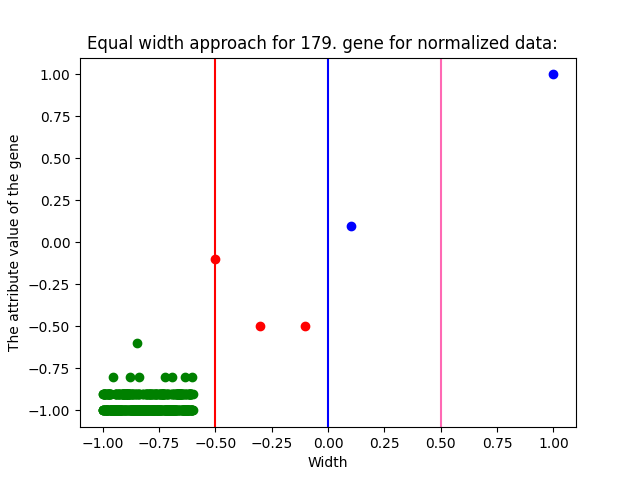

*Figure 32 - The Scatterplot of The Second Random Gene's Equal Width Approach for Normalized Data*

#### 2\.3.1.5 Codes for Third Random Gene
```
#Calculating the width for normalized data
width3_N = (max(value3_N)-min(value3_N))/4
width3_N = round(width3_N,1)
print("\n\nCalculating the width for normalized data : ")
print("\nWidth :", width3_N)

#Calculating the borders
firstline3_N = min(value3_N)+width3_N
secondline3_N = min(value3_N)+width3_N+width3_N
thirdline3_N = min(value3_N)+width3_N+width3_N+width3_N

firstline3_N = round(firstline3_N,1)
secondline3_N = round(secondline3_N,1)
thirdline3_N = round(thirdline3_N,1)

group1forvalue3_N = []
group2forvalue3_N = []
group3forvalue3_N = []
group4forvalue3_N = []

#Placing the values to the groups for value 3 list
for i in range(500):
    if (value3_N[i]< firstline3_N):
        group1forvalue3_N.append(value3_N[i])
        
    elif (value3_N[i]<secondline3_N):
        group2forvalue3_N.append(value3_N[i])

    elif (value3_N[i]<thirdline3_N):
        group3forvalue3_N.append(value3_N[i])
    else:
        group4forvalue3_N.append(value3_N[i])

print("Equal width approach for {}. gene for normalized data: ".format(random3))
print("\nThe attributes between {} and {} :".format(min(value3_N), firstline3_N))
print(group1forvalue3_N)
print("\nThe attributes between {} and {} :".format(firstline3_N, secondline3_N))
print(group2forvalue3_N)
print("\nThe attributes between {} and {} :".format(secondline3_N, thirdline3_N))
print(group3forvalue3_N)
print("\nThe attributes between {} and {} :".format(thirdline3_N, max(value3_N)))
print(group4forvalue3_N)


if(len(group1forvalue3_N)>0):
    x_axis1_3_N = numpy.linspace(min(group1forvalue3_N), max(group1forvalue3_N),len(group1forvalue3_N))
    plt.scatter(x_axis1_3_N, group1forvalue3_N, color='g')

if(len(group2forvalue3_N)>0):
     x_axis2_3_N = numpy.linspace(min(group2forvalue3_N), max(group2forvalue3_N),len(group2forvalue3_N))
     plt.scatter(x_axis2_3_N, group2forvalue3_N, color='r')

if(len(group3forvalue3_N)>0):
    x_axis3_3_N = numpy.linspace(min(group3forvalue3_N), max(group3forvalue3_N),len(group3forvalue3_N))
    plt.scatter(x_axis3_3_N, group3forvalue3_N, color='b')

if(len(group4forvalue3_N)>0):
    x_axis4_3_N = numpy.linspace(min(group4forvalue3_N), max(group4forvalue3_N),len(group4forvalue3_N))
    plt.scatter(x_axis4_3_N, group4forvalue3_N, color='hotpink')

plt.axvline(x = firstline3_N, color = 'r')
plt.axvline(x = secondline3_N, color = 'b')
plt.axvline(x = thirdline3_N, color = 'hotpink')
plt.title("Equal width approach for {}. gene for normalized data: ".format(random3))
plt.xlabel("Width")
plt.ylabel("The attribute value of the gene")

plt.show()
```

*Figure 33 - Third Random Gene's Equal Width Approach Process for Normalized Data*

#### 2\.3.1.6 Codes for Third Random Gene

```
Width : 0.5
Equal width approach for 126. gene for normalized data: 

The attributes between -1.0 and -0.5 :
[-0.9, -0.9, -0.9, -1.0, -0.9, -0.6, -0.9, -0.9, -0.8, -0.9, -0.9, -1.0, -0.9, -1.0, -1.0, -0.9, -1.0, -1.0, -1.0, -1.0, -0.9, -1.0, -0.9, -1.0, -1.0, -1.0, -1.0, -1.0, -0.9, -1.0, -0.9, -1.0, -1.0, -0.9, -1.0, -0.9, -1.0, -0.9, -0.9, -1.0, -1.0, -0.9, -0.9, -1.0, -1.0, -0.9, -0.9, -1.0, -0.9, -0.9, -1.0, -1.0, -1.0, -1.0, -0.9, -1.0, -1.0, -0.7, -1.0, -1.0, -0.9, -1.0, -0.9, -1.0, -1.0, -1.0, -1.0, -0.9, -0.9, -0.9, -0.9, -1.0, -1.0, -0.9, -1.0, -0.9, -0.9, -0.9, -1.0, -0.9, -0.9, -0.9, -1.0, -1.0, -1.0, -1.0, -0.9, -1.0, -1.0, -0.9, -1.0, -0.8, -1.0, -0.9, -1.0, -1.0, -1.0, -1.0, -1.0, -1.0, -1.0, -1.0, -1.0, -1.0, -1.0, -0.9, -0.9, -1.0, -1.0, -0.9, -0.9, -1.0, -0.9, -1.0, -0.9, -0.9, -0.9, -0.9, -1.0, -1.0, -0.9, -0.9, -1.0, -0.9, -0.9, -0.9, -0.9, -0.9, -0.9, -0.9, -0.9, -0.9, -1.0, -1.0, -0.9, -1.0, -0.9, -0.9, -0.9, -0.9, -1.0, -1.0, -1.0, -0.9, -0.9, -1.0, -1.0, -0.9, -0.9, -1.0, -0.9, -0.9, -1.0, -1.0, -1.0, -0.9, -0.9, -0.9, -1.0, -1.0, -0.9, -1.0, -1.0, -1.0, -1.0, -0.9, -0.9, -1.0, -0.9, -0.9, -0.9, -1.0, -1.0, -0.9, -1.0, -0.9, -0.9, -0.8, -0.9, -1.0, -1.0, -0.9, -0.9, -0.9, -1.0, -1.0, -1.0, -0.9, -0.9, -1.0, -1.0, -1.0, -1.0, -0.9, -1.0, -0.9, -0.9, -0.8, -1.0, -1.0, -1.0, -0.9, -0.9, -1.0, -1.0, -1.0, -0.9, -1.0, -1.0, -0.9, -0.9, -1.0, -1.0, -1.0, -1.0, -1.0, -1.0, -0.8, -1.0, -1.0, -1.0, -1.0, -1.0, -1.0, -0.9, -0.9, -1.0, -1.0, -0.9, -1.0, -1.0, -1.0, -1.0, -1.0, -1.0, -0.9, -1.0, -0.9, -0.9, -0.9, -1.0, -0.9, -0.9, -0.9, -1.0, -1.0, -0.9, -1.0, -1.0, -1.0, -1.0, -1.0, -1.0, -1.0, -0.8, -1.0, -0.8, -1.0, -1.0, -1.0, -0.9, -0.9, -0.9, -0.9, -0.9, -1.0, -1.0, -1.0, -0.9, -1.0, -1.0, -0.9, -0.9, -0.9, -0.9, -1.0, -1.0, -0.9, -0.9, -0.9, -1.0, -1.0, -1.0, -0.9, -1.0, -1.0, -1.0, -0.9, -0.8, -1.0, -1.0, -0.9, -0.9, -1.0, -0.9, -0.9, -1.0, -0.9, -0.9, -0.9, -1.0, -0.9, -1.0, -1.0, -1.0, -1.0, -1.0, -1.0, -0.9, -0.9, -0.9, -0.9, -0.9, -1.0, -1.0, -0.9, -0.9, -0.9, -1.0, -1.0, -1.0, -0.9, -0.9, -1.0, -1.0, -0.9, -0.9, -0.9, -0.9, -0.9, -0.9, -0.9, -0.9, -0.9, -0.9, -0.9, -0.9, -1.0, -0.9, -0.9, -1.0, -1.0, -0.9, -0.9, -0.7, -0.9, -0.9, -0.9, -0.9, -1.0, -1.0, -1.0, -1.0, -0.9, -1.0, -1.0, -1.0, -1.0, -0.9, -1.0, -0.9, -0.9, -1.0, -0.9, -1.0, -0.9, -1.0, -1.0, -0.9, -0.9, -1.0, -1.0, -1.0, -1.0, -0.9, -1.0, -0.9, -1.0, -1.0, -0.9, -0.9, -0.9, -1.0, -1.0, -1.0, -0.9, -0.9, -0.9, -1.0, -1.0, -0.9, -0.9, -1.0, -0.9, -0.9, -0.9, -0.9, -1.0, -0.9, -1.0, -0.9, -0.9, -0.9, -1.0, -1.0, -1.0, -1.0, -0.9, -1.0, -0.8, -0.9, -1.0, -0.9, -1.0, -0.9, -0.9, -1.0, -0.9, -1.0, -0.9, -0.9, -0.8, -0.9, -0.9, -0.9, -1.0, -1.0, -1.0, -0.9, -0.9, -1.0, -0.9, -1.0, -1.0, -1.0, -0.9, -0.9, -1.0, -0.9, -1.0, -1.0, -1.0, -0.9, -1.0, -1.0, -1.0, -0.9, -1.0, -0.8, -1.0, -1.0, -1.0, -0.8, -1.0, -0.9, -0.9, -1.0, -1.0, -1.0, -0.9, -0.9, -0.9, -1.0, -1.0, -1.0, -1.0, -0.9, -0.9, -1.0, -0.9, -1.0, -0.9, -0.9, -1.0, -0.9, -0.9, -0.9, -0.8, -0.9, -0.9, -1.0, -0.9, -0.8, -0.9, -0.9, -0.9, -0.9, -0.9, -1.0, -0.9, -1.0, -0.9, -0.8, -1.0, -0.9]

The attributes between -0.5 and 0.0 :
[-0.4, -0.4, -0.4, -0.1]

The attributes between 0.0 and 0.5 :
[]

The attributes between 0.5 and 1.0 :
[1.0]
```

*Figure 34 - Output of The Third Random Gene's Equal Width Approach Process for Normalized Data*

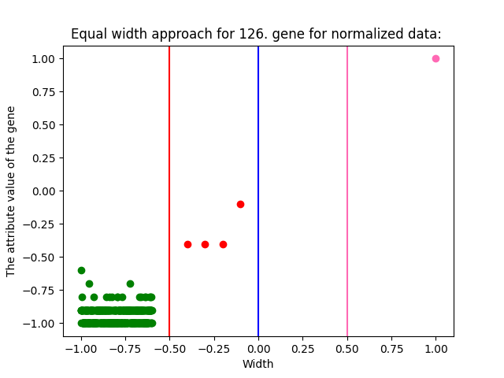

*Figure 35 - The Scatterplot of The Third Random Gene's Equal Width Approach for Normalized Data*
### **2.3.2 Equal Frequency Approach for Normalized Data**

Again, we will apply the same process on the normalized data. In fact, we know that we will not achieve a different result in terms of distribution, but as part of this study, we want to carry out every process, including the ones we are sure of.
#### 2\.3.2.1 Codes for First Random Gene
```
#Question1>a>II-----------------------------------------------------------------------------
#Calculating the frequency for any object
frequency_N = int(len(value1_N)/4)

print("\n\n\n\nThe Frequency is for normalized data: ", frequency)

group1_forvalue1_forfrequency_N = []
group2_forvalue1_forfrequency_N = []
group3_forvalue1_forfrequency_N = []
group4_forvalue1_forfrequency_N = []


for i in range(frequency_N):
    group1_forvalue1_forfrequency_N.append(value1_N[i])
for i in range(frequency_N,2*frequency_N):
    group2_forvalue1_forfrequency_N.append(value1_N[i])
for i in range(2*frequency_N,3*frequency_N):
    group3_forvalue1_forfrequency_N.append(value1_N[i])
for i in range(3*frequency_N,(int(len(value1_N)))):
    group4_forvalue1_forfrequency_N.append(value1_N[i])
    
print("\n\nEqual frequency approach for {}. gene for normalized data: ".format(random1))
print("\nThe attributes between {} and {} :".format(0, frequency_N))
print(group1_forvalue1_forfrequency_N)
print("\nThe attributes between {} and {} :".format(frequency_N, frequency_N*2))
print(group2_forvalue1_forfrequency_N)
print("\nThe attributes between {} and {} :".format(frequency_N*2, frequency_N*3))
print(group3_forvalue1_forfrequency_N)
print("\nThe attributes between {} and {} :".format(frequency_N*3, len(value1_N)))
print(group4_forvalue1_forfrequency_N)


 
x1_1_N = numpy.arange(0,frequency_N)
plt.scatter(x1_1_N, group1_forvalue1_forfrequency_N, color='g')

x1_2_N = numpy.arange(frequency_N,2*frequency_N)
plt.scatter(x1_2_N, group2_forvalue1_forfrequency_N, color='r')

x1_3_N = numpy.arange(2*frequency_N,3*frequency_N)
plt.scatter(x1_3_N, group3_forvalue1_forfrequency_N, color='b')

x1_4_N = numpy.arange(3*frequency_N,4*frequency_N)
plt.scatter(x1_4_N, group4_forvalue1_forfrequency_N, color='hotpink')

plt.axvline(x = frequency_N, color = 'r')
plt.axvline(x = 2*frequency_N, color = 'b')
plt.axvline(x = 3*frequency_N, color = 'hotpink')
plt.title("Equal frequency approach for {}. gene for normalized data: ".format(random1))
plt.xlabel("Frequency")
plt.ylabel("The attribute value of the gene")
plt.show()
```
*Figure 36 - First Random Gene's Equal Frequency Approach Process for Normalized Data*

#### 2\.3.2.2 Outputs for First Random Gene

```
The Frequency is for normalized data:  125


Equal frequency approach for 72. gene for normalized data: 

The attributes between 0 and 125 :
[-0.7, -0.8, -0.8, -0.9, -0.8, -0.5, -0.8, -0.7, -0.7, -0.5, -0.8, -0.8, -0.8, -0.8, -0.8, -0.8, -0.9, -0.8, -0.8, -0.8, -0.8, -0.8, -0.5, -0.8, -0.8, -0.9, -0.8, -0.8, -0.8, -0.8, -0.8, -0.8, -0.8, -0.6, -0.8, -0.8, -0.8, -0.7, -0.7, -0.8, -0.8, -0.8, -0.7, -0.8, -0.8, -0.8, -0.8, -0.8, -0.8, -0.8, -0.8, -0.8, -0.8, -0.8, -0.8, -0.8, -0.8, -0.6, -0.8, -0.8, -0.8, -0.8, -0.8, -0.8, -0.8, -0.8, -0.8, -0.8, -0.8, -0.8, -0.8, -0.8, -0.9, -0.8, -0.9, -0.8, -0.8, -0.8, -0.9, -0.8, -0.7, -0.8, -0.8, -0.8, -0.8, -0.8, -0.8, -0.8, -0.9, -0.6, -0.8, -0.8, -0.8, -0.8, -0.8, -0.8, -0.8, -0.9, -0.9, -0.8, -0.8, -0.8, -0.8, -0.9, -0.8, -0.8, -0.8, -0.8, -0.9, -0.8, -0.8, -0.9, -0.8, -0.8, -0.7, -0.7, -0.7, -0.7, -0.8, -0.8, -0.8, -0.8, -0.8, -0.8, -0.8]

The attributes between 125 and 250 :
[-0.8, -0.8, -0.8, -0.7, -0.8, -0.8, -0.8, -0.8, -0.8, -0.7, -0.9, -0.8, -0.8, -0.8, -0.8, -0.8, -0.9, -0.8, -0.7, -0.8, -0.8, -0.8, -0.8, -0.8, -0.8, -0.8, -0.7, -0.8, -0.8, -0.8, -0.8, -0.8, -0.8, -0.8, -0.8, -0.8, -0.8, -0.8, -0.8, -0.8, -0.8, -0.7, -0.8, -0.8, -0.8, -0.8, -0.8, -0.8, -0.7, -0.8, -0.8, -0.7, -0.3, -0.8, -0.8, -0.8, -0.8, -0.6, -0.8, -0.8, -0.8, -0.8, -0.8, -0.8, -0.8, 0.0, -0.8, -0.8, -0.8, -0.8, -0.8, -0.6, -0.8, -0.4, -0.8, -0.8, -0.8, -0.5, -0.8, -0.8, -0.8, -0.8, -0.8, -0.8, -0.8, -0.7, -0.8, -0.9, -0.8, -0.8, -0.8, -0.8, -0.8, -0.4, -0.8, -0.8, -0.8, -0.8, -0.9, -0.8, -0.8, -0.8, -0.9, -0.8, -0.8, -0.9, -0.8, -0.8, -0.8, -0.8, -0.8, -0.8, -0.9, -0.6, -0.8, -0.8, -0.8, -0.8, -0.8, -0.8, -0.8, -0.9, -0.8, -0.8, -0.9]

The attributes between 250 and 375 :
[-0.8, -0.8, -0.8, -0.9, -0.8, -0.3, -0.8, -0.6, -0.8, -0.8, -0.8, -0.8, -0.7, -0.8, -0.8, -0.8, -0.8, -0.8, -0.9, -0.7, -0.8, -0.8, -0.9, -0.8, -0.8, -0.8, -0.8, -0.8, -0.8, -0.8, -0.8, -0.9, -0.8, -0.8, -0.8, -0.8, -0.8, -0.8, -0.8, -0.6, -0.8, -0.8, -0.8, -0.8, -0.8, -0.8, -0.8, -0.8, -0.8, -0.8, -0.8, -0.8, -0.8, -0.8, -0.8, -0.8, -0.9, -0.8, -0.8, -0.8, 1.0, -0.8, -0.8, -0.8, -0.8, -0.8, -0.8, -0.8, -0.7, -0.8, -0.9, -0.8, -0.8, -0.8, -0.8, -0.8, -0.8, -0.8, -0.7, -0.8, -0.8, -0.7, -0.9, -0.6, -0.7, -0.7, -0.7, -0.7, 0.1, -0.8, -0.8, -0.8, -0.8, -0.8, -0.8, -0.8, -0.8, -0.2, -0.8, -0.8, -0.8, -0.8, -0.8, -0.9, -0.9, -0.8, -0.8, -0.9, -0.9, -0.9, -0.8, -0.8, -0.8, -0.8, -0.5, -0.8, -0.8, -0.8, -0.8, -0.9, -0.8, -0.7, -0.8, -0.8, -0.8]

The attributes between 375 and 500 :
[-0.8, -0.8, -0.8, -0.9, -0.8, -0.8, -0.8, -0.8, -0.8, -0.8, -0.8, -0.8, -0.8, -0.8, -0.8, -0.8, -0.8, -0.8, 0.0, 0.4, -0.8, -0.8, -0.9, -0.8, -0.8, -0.8, -0.8, -1.0, -0.8, -0.8, -0.8, -0.8, -0.8, -0.8, -0.8, -0.8, -0.8, -0.8, -0.8, -0.5, -0.8, -0.9, -0.8, -0.8, -0.8, -0.8, -0.9, -0.8, -0.8, -0.6, -0.7, -0.6, -0.8, -0.7, -0.7, -0.8, -0.8, -0.8, -0.8, -0.7, -0.8, -0.8, -0.8, -0.8, -0.8, -0.8, -0.8, -0.8, -0.8, -0.8, -0.8, -0.9, -0.8, -0.8, -0.8, -0.8, -0.8, -0.8, -0.4, -0.8, -0.8, -0.8, -0.4, -0.8, -0.8, -0.8, -0.8, -0.8, -0.8, -0.8, -0.8, -0.8, -0.8, -0.8, -0.8, -0.8, -0.8, -0.8, -0.8, -0.8, -0.8, -0.8, -0.8, -0.8, -0.8, -0.8, -0.8, -0.5, -0.7, -0.7, -0.8, -0.5, -0.6, -0.8, -0.8, -0.8, -0.8, -0.8, -0.8, -0.8, -0.8, -0.8, -0.7, -0.9, -0.8]
```

*Figure 37 - Output of the First Random Gene's Equal Frequency Approach Process for Normalized Data*

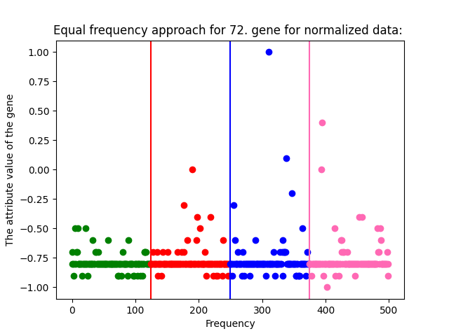

*Figure 38 - The Scatterplot of The First Random Gene's Equal Frequency Approach for Normalized Data*
#### 2\.3.2.3 Codes for Second Random Gene
```
group1_forvalue2_forfrequency_N = []
group2_forvalue2_forfrequency_N = []
group3_forvalue2_forfrequency_N = []
group4_forvalue2_forfrequency_N = []


for i in range(frequency_N):
    group1_forvalue2_forfrequency_N.append(value2_N[i])
for i in range(frequency_N,2*frequency_N):
    group2_forvalue2_forfrequency_N.append(value2_N[i])
for i in range(2*frequency_N,3*frequency_N):
    group3_forvalue2_forfrequency_N.append(value2_N[i])
for i in range(3*frequency_N,(int(len(value2_N)))):
    group4_forvalue2_forfrequency_N.append(value2_N[i])

print("\n\nEqual frequency approach for {}. gene for normalized data:  ".format(random2))
print("\nThe attributes between {} and {} :".format(0, frequency_N))
print(group1_forvalue2_forfrequency_N)
print("\nThe attributes between {} and {} :".format(frequency_N, frequency_N*2))
print(group2_forvalue2_forfrequency_N)
print("\nThe attributes between {} and {} :".format(frequency_N*2, frequency_N*3))
print(group3_forvalue2_forfrequency_N)
print("\nThe attributes between {} and {} :".format(frequency_N*3, len(value2_N)))
print(group4_forvalue2_forfrequency_N)

x2_1_N = numpy.arange(0,frequency_N)
plt.scatter(x2_1_N, group1_forvalue2_forfrequency_N, color='g')

x2_2_N = numpy.arange(frequency_N,2*frequency_N)
plt.scatter(x2_2_N, group2_forvalue2_forfrequency_N, color='r')

x2_3_N = numpy.arange(2*frequency_N,3*frequency_N)
plt.scatter(x2_3_N, group3_forvalue2_forfrequency_N, color='b')

x2_4_N = numpy.arange(3*frequency_N,4*frequency_N)
plt.scatter(x2_4_N, group4_forvalue2_forfrequency_N, color='hotpink')

plt.axvline(x = frequency_N, color = 'r')
plt.axvline(x = 2*frequency_N, color = 'b')
plt.axvline(x = 3*frequency_N, color = 'hotpink')
plt.title("Equal frequency approach for {}. gene for normalized data: ".format(random2))
plt.xlabel("Frequency")
plt.ylabel("The attribute value of the gene")

plt.show()
```

*Figure 39 - Second Random Gene's Equal Frequency Approach Process for Normalized Data*

#### 2\.3.2.4 Outputs for Second Random Gene

```
Equal frequency approach for 179. gene for normalized data:  

The attributes between 0 and 125 :
[-0.9, -1.0, -1.0, -1.0, -1.0, -0.9, -0.9, -0.9, 0.1, -0.9, -0.9, -1.0, -0.9, -1.0, -1.0, -0.9, -1.0, -1.0, -0.9, -1.0, -0.9, -1.0, -0.9, -1.0, -1.0, -1.0, -1.0, -1.0, -1.0, -0.9, -0.9, -1.0, -0.9, -0.9, -1.0, -0.9, -1.0, -0.9, -0.9, -1.0, -0.9, -0.9, -0.9, -1.0, -1.0, -1.0, -1.0, -1.0, -0.9, -1.0, -1.0, -1.0, -1.0, -1.0, -1.0, -1.0, -1.0, -0.8, -1.0, -1.0, -1.0, -1.0, -1.0, -1.0, -1.0, -1.0, -1.0, -1.0, -0.9, -1.0, -1.0, -1.0, -0.9, -0.9, -1.0, -0.9, -1.0, -1.0, -1.0, -1.0, -0.9, -1.0, -1.0, -1.0, -1.0, -1.0, -1.0, -0.9, -1.0, -0.9, -0.9, -0.9, -1.0, -0.9, -1.0, -1.0, -1.0, -1.0, -1.0, -1.0, -0.9, -1.0, -1.0, -1.0, -1.0, -0.9, -0.9, -1.0, -1.0, -1.0, -0.9, -0.9, -1.0, -1.0, -0.9, -0.9, -0.9, -0.9, -1.0, -1.0, -0.9, -0.9, -0.9, -1.0, -1.0]

The attributes between 125 and 250 :
[-1.0, -1.0, -0.9, -0.9, -0.9, -0.9, -1.0, -0.9, -1.0, -0.9, -1.0, -1.0, -0.9, -0.9, -0.9, -0.9, -1.0, -1.0, -0.9, -0.9, -1.0, -0.9, -0.9, -0.9, -1.0, -0.9, -0.8, -1.0, -1.0, -1.0, -1.0, -0.9, -1.0, -0.9, -1.0, -1.0, -1.0, -0.9, -1.0, -1.0, -0.9, -0.9, -1.0, -1.0, -1.0, -0.9, -1.0, -1.0, -0.9, -1.0, -1.0, -1.0, -0.9, -1.0, -1.0, -1.0, -1.0, -0.9, -0.9, -1.0, -1.0, -1.0, -0.9, -1.0, -1.0, -0.6, -1.0, -1.0, -1.0, -1.0, -1.0, -0.9, -1.0, -0.8, -1.0, -1.0, -0.9, -0.9, -0.9, -1.0, -1.0, -1.0, -1.0, -1.0, -1.0, -1.0, -1.0, -1.0, -1.0, -1.0, -1.0, -1.0, -1.0, -0.9, -1.0, -1.0, -1.0, -0.9, -1.0, -1.0, -1.0, -1.0, -1.0, -1.0, -0.9, -1.0, -1.0, -1.0, -1.0, -1.0, -1.0, -1.0, -1.0, -0.9, -0.9, -0.9, -1.0, -1.0, -0.9, -0.9, -1.0, -1.0, -1.0, -1.0, -1.0]

The attributes between 250 and 375 :
[-0.9, -1.0, -1.0, -1.0, -1.0, -0.9, -1.0, -0.9, -0.9, -1.0, -1.0, -0.9, -0.9, -1.0, -0.9, -0.9, -1.0, -1.0, -1.0, -0.9, -1.0, -1.0, -1.0, -0.9, -1.0, -0.9, -1.0, -1.0, -0.9, -1.0, -1.0, -1.0, -0.9, -1.0, -1.0, -1.0, -1.0, -1.0, -1.0, -0.9, -0.9, -1.0, -0.9, -0.9, -1.0, -1.0, -0.9, -1.0, -1.0, -0.9, -1.0, -1.0, -0.9, -1.0, -1.0, -1.0, -1.0, -1.0, -1.0, -1.0, -0.1, -1.0, -0.9, -0.9, -1.0, -1.0, -1.0, -0.9, -0.9, -0.9, -1.0, -1.0, -1.0, -1.0, -0.9, -0.9, -1.0, -0.9, -0.9, -1.0, -0.9, -0.9, -1.0, -0.9, -0.9, -0.9, -0.9, -0.9, -0.5, -0.9, -1.0, -1.0, -1.0, -1.0, -1.0, -1.0, -0.9, -0.8, -1.0, -1.0, -1.0, -0.9, -1.0, -1.0, -1.0, -0.9, -0.9, -1.0, -1.0, -1.0, -1.0, -1.0, -1.0, -0.9, -0.9, -1.0, -1.0, -1.0, -1.0, -1.0, -1.0, -1.0, -0.9, -1.0, -1.0]

The attributes between 375 and 500 :
[-1.0, -1.0, -1.0, -1.0, -1.0, -1.0, -1.0, -0.9, -0.9, -0.8, -1.0, -1.0, -1.0, -0.9, -1.0, -1.0, -1.0, -1.0, 1.0, -0.5, -0.9, -1.0, -1.0, -0.9, -1.0, -1.0, -1.0, -1.0, -0.9, -1.0, -0.9, -1.0, -0.9, -1.0, -1.0, -1.0, -1.0, -0.9, -0.9, -0.9, -0.9, -1.0, -0.9, -0.9, -1.0, -0.9, -1.0, -0.9, -1.0, -0.9, -0.9, -0.9, -0.9, -0.9, -0.9, -1.0, -1.0, -0.9, -0.9, -0.9, -1.0, -0.9, -0.9, -1.0, -1.0, -0.9, -0.9, -1.0, -0.9, -1.0, -1.0, -1.0, -0.9, -1.0, -1.0, -1.0, -1.0, -1.0, -0.9, -1.0, -1.0, -1.0, -0.8, -1.0, -0.9, -0.9, -1.0, -1.0, -1.0, -0.9, -1.0, -1.0, -0.9, -1.0, -1.0, -1.0, -1.0, -1.0, -1.0, -1.0, -1.0, -0.9, -0.9, -1.0, -1.0, -0.9, -0.9, -0.9, -1.0, -0.9, -1.0, -0.9, -0.9, -1.0, -1.0, -0.9, -0.9, -1.0, -1.0, -1.0, -1.0, -1.0, -0.8, -1.0, -0.9]
```

*Figure 40 - Output of The Second Random Gene's Equal Frequency Approach Process for Normalized Data*

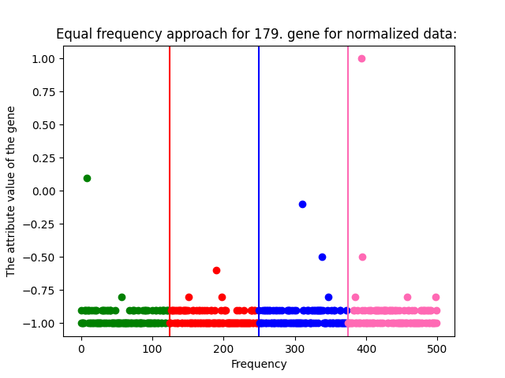

*Figure 41 - The Scatterplot of The Second Random Gene's Equal Frequency Approach for Normalized Data*
#### 2\.3.2.5 Codes for Second Random Gene
```
group1_forvalue3_forfrequency_N = []
group2_forvalue3_forfrequency_N = []
group3_forvalue3_forfrequency_N = []
group4_forvalue3_forfrequency_N = []


for i in range(frequency_N):
    group1_forvalue3_forfrequency_N.append(value3_N[i])
for i in range(frequency_N,2*frequency_N):
    group2_forvalue3_forfrequency_N.append(value3_N[i])
for i in range(2*frequency_N,3*frequency_N):
    group3_forvalue3_forfrequency_N.append(value3_N[i])
for i in range(3*frequency_N,(int(len(value1_N)))):
    group4_forvalue3_forfrequency_N.append(value3_N[i])

print("\n\nEqual frequency approach for {}. gene for normalized data: ".format(random3))
print("\nThe attributes between {} and {} :".format(0, frequency_N))
print(group1_forvalue3_forfrequency_N)
print("\nThe attributes between {} and {} :".format(frequency_N, frequency_N*2))
print(group2_forvalue3_forfrequency_N)
print("\nThe attributes between {} and {} :".format(frequency_N*2, frequency_N*3))
print(group3_forvalue3_forfrequency_N)
print("\nThe attributes between {} and {} :".format(frequency_N*3, len(value3_N)))
print(group4_forvalue3_forfrequency_N)

x3_1_N = numpy.arange(0,frequency_N)
plt.scatter(x3_1_N, group1_forvalue3_forfrequency_N, color='g')

x3_2_N = numpy.arange(frequency_N,2*frequency_N)
plt.scatter(x3_2_N, group2_forvalue3_forfrequency_N, color='r')

x3_3_N = numpy.arange(2*frequency_N,3*frequency_N)
plt.scatter(x3_3_N, group3_forvalue3_forfrequency_N, color='b')

x3_4_N = numpy.arange(3*frequency_N,4*frequency_N)
plt.scatter(x3_4_N, group4_forvalue3_forfrequency_N, color='hotpink')

plt.axvline(x = frequency_N, color = 'r')
plt.axvline(x = 2*frequency_N, color = 'b')
plt.axvline(x = 3*frequency_N, color = 'hotpink')
plt.title("Equal frequency approach for {}. gene for normalized data: ".format(random3))
plt.xlabel("Frequency")
plt.ylabel("The attribute value of the gene")

plt.show()
```

*Figure 42 - Third Random Gene's Equal Frequency Approach Process for Normalized Data*

#### 2\.3.2.6 Outputs for Third Random Gene

```
Equal frequency approach for 126. gene for normalized data: 

The attributes between 0 and 125 :
[-0.9, -0.9, -0.9, -1.0, -0.9, -0.6, -0.9, -0.9, -0.8, -0.9, -0.9, -1.0, -0.9, -1.0, -1.0, -0.9, -1.0, -1.0, -1.0, -1.0, -0.9, -1.0, -0.9, -1.0, -1.0, -1.0, -1.0, -1.0, -0.9, -1.0, -0.9, -1.0, -1.0, -0.9, -1.0, -0.9, -1.0, -0.9, -0.9, -1.0, -1.0, -0.9, -0.9, -1.0, -1.0, -0.9, -0.9, -1.0, -0.9, -0.9, -1.0, -1.0, -1.0, -1.0, -0.9, -1.0, -1.0, -0.7, -1.0, -1.0, -0.9, -1.0, -0.9, -1.0, -1.0, -1.0, -1.0, -0.9, -0.9, -0.9, -0.9, -1.0, -1.0, -0.9, -1.0, -0.9, -0.9, -0.9, -1.0, -0.9, -0.9, -0.9, -1.0, -1.0, -1.0, -1.0, -0.9, -1.0, -1.0, -0.9, -1.0, -0.8, -1.0, -0.9, -1.0, -1.0, -1.0, -1.0, -1.0, -1.0, -1.0, -1.0, -1.0, -1.0, -1.0, -0.9, -0.9, -1.0, -1.0, -0.9, -0.9, -1.0, -0.9, -1.0, -0.9, -0.9, -0.9, -0.9, -1.0, -1.0, -0.9, -0.9, -1.0, -0.9, -0.9]

The attributes between 125 and 250 :
[-0.9, -0.9, -0.9, -0.9, -0.9, -0.9, -0.9, -1.0, -1.0, -0.9, -1.0, -0.9, -0.9, -0.9, -0.9, -1.0, -1.0, -1.0, -0.9, -0.9, -1.0, -1.0, -0.9, -0.9, -1.0, -0.9, -0.9, -1.0, -1.0, -1.0, -0.9, -0.9, -0.9, -1.0, -1.0, -0.9, -1.0, -1.0, -1.0, -1.0, -0.9, -0.9, -1.0, -0.9, -0.9, -0.9, -1.0, -1.0, -0.9, -1.0, -0.9, -0.9, -0.8, -0.9, -1.0, -1.0, -0.9, -0.9, -0.9, -1.0, -1.0, -1.0, -0.9, -0.9, -1.0, -0.4, -1.0, -1.0, -1.0, -0.9, -1.0, -0.9, -0.9, -0.8, -1.0, -1.0, -1.0, -0.9, -0.9, -1.0, -1.0, -1.0, -0.9, -1.0, -1.0, -0.9, -0.9, -1.0, -1.0, -1.0, -1.0, -1.0, -1.0, -0.8, -1.0, -1.0, -1.0, -1.0, -1.0, -1.0, -0.9, -0.9, -1.0, -1.0, -0.9, -1.0, -1.0, -1.0, -1.0, -1.0, -1.0, -0.9, -1.0, -0.9, -0.9, -0.9, -1.0, -0.9, -0.9, -0.9, -1.0, -1.0, -0.9, -1.0, -1.0]

The attributes between 250 and 375 :
[-1.0, -1.0, -1.0, -1.0, -1.0, -0.8, -1.0, -0.8, -1.0, -1.0, -1.0, -0.9, -0.9, -0.9, -0.9, -0.9, -1.0, -1.0, -1.0, -0.9, -1.0, -1.0, -0.9, -0.9, -0.9, -0.9, -1.0, -1.0, -0.9, -0.9, -0.9, -1.0, -1.0, -1.0, -0.9, -1.0, -1.0, -1.0, -0.9, -0.8, -1.0, -1.0, -0.9, -0.9, -1.0, -0.9, -0.9, -1.0, -0.9, -0.9, -0.9, -1.0, -0.9, -1.0, -1.0, -1.0, -1.0, -1.0, -1.0, -0.9, 1.0, -0.9, -0.9, -0.9, -0.9, -1.0, -1.0, -0.9, -0.9, -0.9, -1.0, -1.0, -1.0, -0.9, -0.9, -1.0, -1.0, -0.9, -0.9, -0.9, -0.9, -0.9, -0.9, -0.9, -0.9, -0.9, -0.9, -0.9, -0.4, -0.9, -1.0, -0.9, -0.9, -1.0, -1.0, -0.9, -0.9, -0.7, -0.9, -0.9, -0.9, -0.9, -1.0, -1.0, -1.0, -1.0, -0.9, -1.0, -1.0, -1.0, -1.0, -0.9, -1.0, -0.9, -0.9, -1.0, -0.9, -1.0, -0.9, -1.0, -1.0, -0.9, -0.9, -1.0, -1.0]

The attributes between 375 and 500 :
[-1.0, -1.0, -0.9, -1.0, -0.9, -1.0, -1.0, -0.9, -0.9, -0.9, -1.0, -1.0, -1.0, -0.9, -0.9, -0.9, -1.0, -1.0, -0.4, -0.1, -0.9, -0.9, -1.0, -0.9, -0.9, -0.9, -0.9, -1.0, -0.9, -1.0, -0.9, -0.9, -0.9, -1.0, -1.0, -1.0, -1.0, -0.9, -1.0, -0.8, -0.9, -1.0, -0.9, -1.0, -0.9, -0.9, -1.0, -0.9, -1.0, -0.9, -0.9, -0.8, -0.9, -0.9, -0.9, -1.0, -1.0, -1.0, -0.9, -0.9, -1.0, -0.9, -1.0, -1.0, -1.0, -0.9, -0.9, -1.0, -0.9, -1.0, -1.0, -1.0, -0.9, -1.0, -1.0, -1.0, -0.9, -1.0, -0.8, -1.0, -1.0, -1.0, -0.8, -1.0, -0.9, -0.9, -1.0, -1.0, -1.0, -0.9, -0.9, -0.9, -1.0, -1.0, -1.0, -1.0, -0.9, -0.9, -1.0, -0.9, -1.0, -0.9, -0.9, -1.0, -0.9, -0.9, -0.9, -0.8, -0.9, -0.9, -1.0, -0.9, -0.8, -0.9, -0.9, -0.9, -0.9, -0.9, -1.0, -0.9, -1.0, -0.9, -0.8, -1.0, -0.9]
```

*Figure 43 - Output of The Third Random Gene's Equal Frequency Approach Process for Normalized Data*

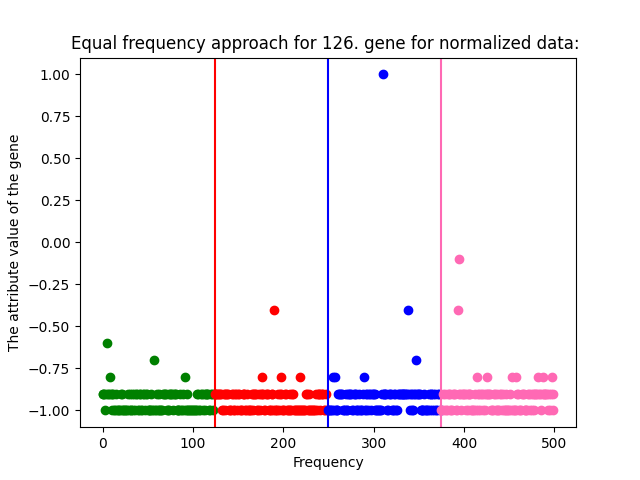

*Figure 44 - The Scatterplot of The Third Random Gene's Equal Frequency Approach for Normalized Data*
### **2.3.3 The Euclidian Distance for Normalized Data**
We will apply all the operations we applied in 2.2.1 to the normalized data and evaluate our observations in the conclusion section.
#### 2\.3.3.1 Codes for Five Random Genes
```
#Question 2 - Attribute Similarity for Normalized Data----------------------------------------------------------
#Part B> The Euclidian Distance for normalized data


value4_N = Normalized_data_list[random4]
value5_N = Normalized_data_list[random5]

#Euclidian Distance Between value1 and value2 for normalized data
answersquare_val1val2_N = 0
for i in range(500):
    answersquare_val1val2_N += (value1_N[i]-value2_N[i])**2

answer_val1val2_N = answersquare_val1val2_N**0.5
answer_val1val2_N = round(answer_val1val2_N,1)
print("\n\nEuclidian Distance for Normalized Data-----------------------------------------------------------------")
print("\nEuclidian Distance Between {}. gene and {}. gene for normalized data is : {}".format(random1, random2, answer_val1val2_N ))

#Euclidian Distance Between value1 and value3 for normalized data
answersquare_val1val3_N = 0
for i in range(500):
    answersquare_val1val3_N += (value1_N[i]-value3_N[i])**2

answer_val1val3_N = answersquare_val1val3_N**0.5
answer_val1val3_N = round(answer_val1val3_N,1)
print("\nEuclidian Distance Between {}. gene and {}. gene for normalized data is : {}".format(random1, random3, answer_val1val3_N ))


#Euclidian Distance Between value1 and value4 for normalized data
answersquare_val1val4_N = 0
for i in range(500):
    answersquare_val1val4_N += (value1_N[i]-value4_N[i])**2

answer_val1val4_N = answersquare_val1val4_N**0.5
answer_val1val4_N = round(answer_val1val4_N,1)
print("\nEuclidian Distance Between {}. gene and {}. gene for normalized data is : {}".format(random1, random4, answer_val1val4_N ))

#Euclidian Distance Between value1 and value5 for normalized data
answersquare_val1val5_N = 0
for i in range(500):
    answersquare_val1val5_N += (value1_N[i]-value5_N[i])**2

answer_val1val5_N = answersquare_val1val5_N**0.5
answer_val1val5_N = round(answer_val1val5_N,1)
print("\nEuclidian Distance Between {}. gene and {}. gene for normalized data is : {}".format(random1, random5, answer_val1val5_N ))

#Euclidian Distance Between value2 and value3 for normalized data
answersquare_val2val3_N = 0
for i in range(500):
    answersquare_val2val3_N += (value2_N[i]-value3_N[i])**2

answer_val2val3_N = answersquare_val2val3_N**0.5
answer_val2val3_N = round(answer_val2val3_N,1)
print("\nEuclidian Distance Between {}. gene and {}. gene for normalized data is : {}".format(random2, random3, answer_val2val3_N ))

#Euclidian Distance Between value2 and value4 for normalized data
answersquare_val2val4_N = 0
for i in range(500):
    answersquare_val2val4_N += (value2_N[i]-value4_N[i])**2

answer_val2val4_N = answersquare_val2val4_N**0.5
answer_val2val4_N = round(answer_val2val4_N,1)
print("\nEuclidian Distance Between {}. gene and {}. gene for normalized data is : {}".format(random2, random4, answer_val2val4_N ))
 
#Euclidian Distance Between value2 and value5 for normalized data
answersquare_val2val5_N = 0
for i in range(500):
    answersquare_val2val5_N += (value2_N[i]-value5_N[i])**2

answer_val2val5_N = answersquare_val2val5_N**0.5
answer_val2val5_N = round(answer_val2val5_N,1)
print("\nEuclidian Distance Between {}. gene and {}. gene for normalized data is : {}".format(random2, random5, answer_val2val5_N ))

#Euclidian Distance Between value3 and value4 for normalized data
answersquare_val3val4_N = 0
for i in range(500):
    answersquare_val3val4_N += (value3_N[i]-value4_N[i])**2

answer_val3val4_N = answersquare_val3val4_N**0.5
answer_val3val4_N = round(answer_val3val4_N,1)
print("\nEuclidian Distance Between {}. gene and {}. gene for normalized data is : {}".format(random3, random4, answer_val3val4_N ))

#Euclidian Distance Between value3 and value5 for normalized data
answersquare_val3val5_N = 0
for i in range(500):
    answersquare_val3val5_N += (value3_N[i]-value5_N[i])**2

answer_val3val5_N = answersquare_val3val5_N**0.5
answer_val3val5_N = round(answer_val3val5_N,1)
print("\nEuclidian Distance Between {}. gene and {}. gene for normalized data is : {}".format(random3, random5, answer_val3val5_N ))

#Euclidian Distance Between value4 and value5 for normalized data
answersquare_val4val5_N = 0
for i in range(500):
    answersquare_val4val5_N += (value4_N[i]-value5_N[i])**2

answer_val4val5_N = answersquare_val4val5_N**0.5
answer_val4val5_N = round(answer_val4val5_N,1)
print("\nEuclidian Distance Between {}. gene and {}. gene for normalized data is : {}".format(random4, random5, answer_val4val5_N ))
```

*Figure 45 - The Process of The Euclidian Distance for Five Random Genes of Normalized Data*

#### 2\.3.3.2 Outputs for Five Random Genes

```
Euclidian Distance for Normalized Data-----------------------------------------------------------------

Euclidian Distance Between 72. gene and 179. gene for normalized data is : 4.7

Euclidian Distance Between 72. gene and 126. gene for normalized data is : 4.0

Euclidian Distance Between 72. gene and 161. gene for normalized data is : 3.4

Euclidian Distance Between 72. gene and 18. gene for normalized data is : 2.1

Euclidian Distance Between 179. gene and 126. gene for normalized data is : 2.4

Euclidian Distance Between 179. gene and 161. gene for normalized data is : 2.6

Euclidian Distance Between 179. gene and 18. gene for normalized data is : 3.4

Euclidian Distance Between 126. gene and 161. gene for normalized data is : 1.3

Euclidian Distance Between 126. gene and 18. gene for normalized data is : 2.5

Euclidian Distance Between 161. gene and 18. gene for normalized data is : 2.1
```

*Figure 46 - The Output of The Five Random Genes' Euclidian Distance for Normalized Data*

We observe interesting discrepancies between the results of the original data and the results of the normalized data. 

<p align="right"><i>Table 1 - Euclidian Distance Comparisons of Original and Normalized Data</i></p>

|Original Datas' Euclidian Distances|Genes|Normalized Datas' Euclidian Distances|
| :-: | :-: | :-: |
|19255\.0|72 and 179|4\.7|
|7832\.7|72 and 126|4\.0|
|19255\.0|72 and 161|3\.4|
|7832\.7|72 and 18|2\.1|
|18567\.5|179 and 126|2\.4|
|0\.0|179 and 161|2\.6|
|18567\.5|179 and 18|3\.4|
|18567\.5|126 and 161|1\.3|
|0\.0|126 and 18|2\.5|
|18567\.5|161 and 18|2\.1|


The most similar genes, according to our new study, are genes 126 and 161. The most dissimilar genes are genes 72 and 179. Although the two studies do not reach the same conclusion, I think that normalized data will give healthier and clearer results. The results that are consistent are the distance of the 72nd gene to the 179th gene. However, when we looked again at the unnormalized data, we saw that genes 126 and 161 that were not similar according to their euclidian distance were slightly similar according to cosine similarity, but very similar according to the correlation results. We will also consider these consistent and inconsistent results. However, when we normalize the data, we see that there are inconsistencies in the genes that we experienced inconsistency before. And we can say that the gene causing the most inconsistency is the 161st gene.

### **2.3.4 The Cosine Similarity for Normalized Data**
In our previous study which is 2.3.3, we conducted a study in which we obtained different results with the original data. Now we will use a different method with normalized data and see if we can observe the same difference.
#### 2\.3.4.1 Codes for Five Random Genes
```
#Part B> Cosine Similarity for normalized data-----------------------------------------------------------
#Cosine Similarity Between Value 1 and Value 2 for normalized data
val1_val2_d1d2_N = 0
val1_val2_d1d1_N = 0
val1_val2_d2d2_N = 0
for i in range(500):
    val1_val2_d1d2_N += value1_N[i]*value2_N[i]
    val1_val2_d1d1_N += value1_N[i]**2
    val1_val2_d2d2_N += value2_N[i]**2

CosSimilarity_val1_val2_N = val1_val2_d1d2_N / ((val1_val2_d1d1_N**0.5) *  (val1_val2_d2d2_N**0.5) )
CosSimilarity_val1_val2_N = round(CosSimilarity_val1_val2_N,1)
print("\nCosine Similarity between {} and {} for normalized data is : {}".format(random1,random2,CosSimilarity_val1_val2_N))

    
#Cosine Similarity Between Value 1 and Value 3 for normalized data
val1_val3_d1d2_N = 0
val1_val3_d1d1_N = 0
val1_val3_d2d2_N = 0
for i in range(500):
    val1_val3_d1d2_N += value1_N[i]*value3_N[i]
    val1_val3_d1d1_N += value1_N[i]**2
    val1_val3_d2d2_N += value3_N[i]**2

CosSimilarity_val1_val3_N = val1_val3_d1d2_N / ((val1_val3_d1d1_N**0.5) *  (val1_val3_d2d2_N**0.5) )
CosSimilarity_val1_val3_N = round(CosSimilarity_val1_val3_N,1)
print("\nCosine Similarity between {} and {} for normalized data is : {}".format(random1,random3,CosSimilarity_val1_val3_N))


#Cosine Similarity Between Value 1 and Value 4 for normalized data
val1_val4_d1d2_N = 0
val1_val4_d1d1_N = 0
val1_val4_d2d2_N = 0
for i in range(500):
    val1_val4_d1d2_N += value1_N[i]*value4_N[i]
    val1_val4_d1d1_N += value1_N[i]**2
    val1_val4_d2d2_N += value4_N[i]**2

CosSimilarity_val1_val4_N = val1_val4_d1d2_N / ((val1_val4_d1d1_N**0.5) *  (val1_val4_d2d2_N**0.5) )
CosSimilarity_val1_val4_N = round(CosSimilarity_val1_val4_N,1)
print("\nCosine Similarity between {} and {} for normalized data is : {}".format(random1,random4,CosSimilarity_val1_val4_N))


#Cosine Similarity Between Value 1 and Value 5 for normalized data
val1_val5_d1d2_N = 0
val1_val5_d1d1_N = 0
val1_val5_d2d2_N = 0
for i in range(500):
    val1_val5_d1d2_N += value1_N[i]*value5_N[i]
    val1_val5_d1d1_N += value1_N[i]**2
    val1_val5_d2d2_N += value5_N[i]**2

CosSimilarity_val1_val5_N = val1_val5_d1d2_N / ((val1_val5_d1d1_N**0.5) *  (val1_val5_d2d2_N**0.5) )
CosSimilarity_val1_val5_N = round(CosSimilarity_val1_val5_N,1)
print("\nCosine Similarity between {} and {} for normalized data is : {}".format(random1,random5,CosSimilarity_val1_val5_N))


#Cosine Similarity Between Value 2 and Value 3 for normalized data
val2_val3_d1d2_N = 0
val2_val3_d1d1_N = 0
val2_val3_d2d2_N = 0
for i in range(500):
    val2_val3_d1d2_N += value2_N[i]*value3_N[i]
    val2_val3_d1d1_N += value2_N[i]**2
    val2_val3_d2d2_N += value3_N[i]**2

CosSimilarity_val2_val3_N = val2_val3_d1d2_N / ((val2_val3_d1d1_N**0.5) *  (val2_val3_d2d2_N**0.5) )
CosSimilarity_val2_val3_N = round(CosSimilarity_val2_val3_N,1)
print("\nCosine Similarity between {} and {} for normalized data is : {}".format(random2,random3,CosSimilarity_val2_val3_N))

#Cosine Similarity Between Value 2 and Value 4 for normalized data
val2_val4_d1d2_N = 0
val2_val4_d1d1_N = 0
val2_val4_d2d2_N = 0
for i in range(500):
    val2_val4_d1d2_N += value2_N[i]*value4_N[i]
    val2_val4_d1d1_N += value2_N[i]**2
    val2_val4_d2d2_N += value4_N[i]**2

CosSimilarity_val2_val4_N = val2_val4_d1d2_N / ((val2_val4_d1d1_N**0.5) *  (val2_val4_d2d2_N**0.5) )
CosSimilarity_val2_val4_N = round(CosSimilarity_val2_val4_N,1)
print("\nCosine Similarity between {} and {} for normalized data is : {}".format(random2,random4,CosSimilarity_val2_val4_N))

#Cosine Similarity Between Value 2 and Value 5 for normalized data
val2_val5_d1d2_N = 0
val2_val5_d1d1_N = 0
val2_val5_d2d2_N = 0
for i in range(500):
    val2_val5_d1d2_N += value2_N[i]*value4_N[i]
    val2_val5_d1d1_N += value2_N[i]**2
    val2_val5_d2d2_N += value4_N[i]**2

CosSimilarity_val2_val5_N = val2_val5_d1d2_N / ((val2_val5_d1d1_N**0.5) *  (val2_val5_d2d2_N**0.5) )
CosSimilarity_val2_val5_N = round(CosSimilarity_val2_val5_N,1)
print("\nCosine Similarity between {} and {} for normalized data is : {}".format(random2,random5,CosSimilarity_val2_val5_N))


#Cosine Similarity Between Value 3 and Value 4 for normalized data
val3_val4_d1d2_N = 0
val3_val4_d1d1_N = 0
val3_val4_d2d2_N = 0
for i in range(500):
    val3_val4_d1d2_N += value3_N[i]*value4_N[i]
    val3_val4_d1d1_N += value3_N[i]**2
    val3_val4_d2d2_N += value4_N[i]**2

CosSimilarity_val3_val4_N = val3_val4_d1d2_N / ((val3_val4_d1d1_N**0.5) *  (val3_val4_d2d2_N**0.5) )
CosSimilarity_val3_val4_N = round(CosSimilarity_val3_val4_N,1)
print("\nCosine Similarity between {} and {} for normalized data is : {}".format(random3,random4,CosSimilarity_val3_val4_N))

#Cosine Similarity Between Value 3 and Value 5 for normalized data
val3_val5_d1d2_N = 0
val3_val5_d1d1_N = 0
val3_val5_d2d2_N = 0
for i in range(500):
    val3_val5_d1d2_N += value3_N[i]*value5_N[i]
    val3_val5_d1d1_N += value3_N[i]**2
    val3_val5_d2d2_N += value5_N[i]**2

CosSimilarity_val3_val5_N = val3_val5_d1d2_N / ((val3_val5_d1d1_N**0.5) *  (val3_val5_d2d2_N**0.5) )
CosSimilarity_val3_val5_N = round(CosSimilarity_val3_val5_N,1)
print("\nCosine Similarity between {} and {} for normalized data is : {}".format(random3,random5,CosSimilarity_val3_val5_N))

#Cosine Similarity Between Value 4 and Value 5 for normalized data
val4_val5_d1d2_N = 0
val4_val5_d1d1_N = 0
val4_val5_d2d2_N = 0
for i in range(500):
    val4_val5_d1d2_N += value4_N[i]*value5_N[i]
    val4_val5_d1d1_N += value4_N[i]**2
    val4_val5_d2d2_N += value5_N[i]**2

CosSimilarity_val4_val5_N = val4_val5_d1d2_N / ((val4_val5_d1d1_N**0.5) *  (val4_val5_d2d2_N**0.5) )
CosSimilarity_val4_val5_N = round(CosSimilarity_val4_val5_N,1)
print("\nCosine Similarity between {} and {} for normalized data is : {}".format(random4,random5,CosSimilarity_val4_val5_N))
```

*Figure 47 - The Process of The Cosine Similarity for Five Random Genes of Normalized Data*

#### 2\.3.4.2 Outputs for Five Random Genes

```
Cosine Similarity for normalized data-----------------------------------------------------------------

Cosine Similarity between 72 and 179 for normalized data is : 1.0

Cosine Similarity between 72 and 126 for normalized data is : 1.0

Cosine Similarity between 72 and 161 for normalized data is : 1.0

Cosine Similarity between 72 and 18 for normalized data is : 1.0

Cosine Similarity between 179 and 126 for normalized data is : 1.0

Cosine Similarity between 179 and 161 for normalized data is : 1.0

Cosine Similarity between 179 and 18 for normalized data is : 1.0

Cosine Similarity between 126 and 161 for normalized data is : 1.0

Cosine Similarity between 126 and 18 for normalized data is : 1.0

Cosine Similarity between 161 and 18 for normalized data is : 1.0
```

*Figure 48 - The Output of The Five Random Genes' Cosine Similarity for Normalized Data*

<p align="right"><i>Table 2 - Cosine Similarity Comparisons of Original and Normalized Data</i></p>

|Original Data’s Cosine Similarities|Genes|Normalized Data’s Cosine Similarities|
| :-: | :-: | :-: |
|0\.7|72 and 179|1\.0|
|0\.9|72 and 126|1\.0|
|0\.7|72 and 161|1\.0|
|0\.9|72 and 18|1\.0|
|0\.7|179 and 126|1\.0|
|1\.0|179 and 161|1\.0|
|1\.0|179 and 18|1\.0|
|0\.7|126 and 161|1\.0|
|1\.0|126 and 18|1\.0|
|0\.7|161 and 18|1\.0|


We found all results to be 1.0 with normalized data. It is difficult to make an effective analysis of this study. Because the results are consistent and together with the results in our next study, our observations about the whole study in general will be more inclusive.
### **2.3.5 The Correlation for Normalized Data**
We found the results of our correlation study with the original data insufficient. I think that the correlation studies we will do with normalized data will give more effective and clear results.
#### 2\.3.5.1 Codes for Five Random Genes
```
#Part B> Cosine Similarity for normalized data-----------------------------------------------------------
#Cosine Similarity Between Value 1 and Value 2 for normalized data
val1_val2_d1d2_N = 0
val1_val2_d1d1_N = 0
val1_val2_d2d2_N = 0
for i in range(500):
    val1_val2_d1d2_N += value1_N[i]*value2_N[i]
    val1_val2_d1d1_N += value1_N[i]**2
    val1_val2_d2d2_N += value2_N[i]**2

CosSimilarity_val1_val2_N = val1_val2_d1d2_N / ((val1_val2_d1d1_N**0.5) *  (val1_val2_d2d2_N**0.5) )
CosSimilarity_val1_val2_N = round(CosSimilarity_val1_val2_N,1)
print("\nCosine Similarity between {} and {} for normalized data is : {}".format(random1,random2,CosSimilarity_val1_val2_N))

    
#Cosine Similarity Between Value 1 and Value 3 for normalized data
val1_val3_d1d2_N = 0
val1_val3_d1d1_N = 0
val1_val3_d2d2_N = 0
for i in range(500):
    val1_val3_d1d2_N += value1_N[i]*value3_N[i]
    val1_val3_d1d1_N += value1_N[i]**2
    val1_val3_d2d2_N += value3_N[i]**2

CosSimilarity_val1_val3_N = val1_val3_d1d2_N / ((val1_val3_d1d1_N**0.5) *  (val1_val3_d2d2_N**0.5) )
CosSimilarity_val1_val3_N = round(CosSimilarity_val1_val3_N,1)
print("\nCosine Similarity between {} and {} for normalized data is : {}".format(random1,random3,CosSimilarity_val1_val3_N))


#Cosine Similarity Between Value 1 and Value 4 for normalized data
val1_val4_d1d2_N = 0
val1_val4_d1d1_N = 0
val1_val4_d2d2_N = 0
for i in range(500):
    val1_val4_d1d2_N += value1_N[i]*value4_N[i]
    val1_val4_d1d1_N += value1_N[i]**2
    val1_val4_d2d2_N += value4_N[i]**2

CosSimilarity_val1_val4_N = val1_val4_d1d2_N / ((val1_val4_d1d1_N**0.5) *  (val1_val4_d2d2_N**0.5) )
CosSimilarity_val1_val4_N = round(CosSimilarity_val1_val4_N,1)
print("\nCosine Similarity between {} and {} for normalized data is : {}".format(random1,random4,CosSimilarity_val1_val4_N))


#Cosine Similarity Between Value 1 and Value 5 for normalized data
val1_val5_d1d2_N = 0
val1_val5_d1d1_N = 0
val1_val5_d2d2_N = 0
for i in range(500):
    val1_val5_d1d2_N += value1_N[i]*value5_N[i]
    val1_val5_d1d1_N += value1_N[i]**2
    val1_val5_d2d2_N += value5_N[i]**2

CosSimilarity_val1_val5_N = val1_val5_d1d2_N / ((val1_val5_d1d1_N**0.5) *  (val1_val5_d2d2_N**0.5) )
CosSimilarity_val1_val5_N = round(CosSimilarity_val1_val5_N,1)
print("\nCosine Similarity between {} and {} for normalized data is : {}".format(random1,random5,CosSimilarity_val1_val5_N))


#Cosine Similarity Between Value 2 and Value 3 for normalized data
val2_val3_d1d2_N = 0
val2_val3_d1d1_N = 0
val2_val3_d2d2_N = 0
for i in range(500):
    val2_val3_d1d2_N += value2_N[i]*value3_N[i]
    val2_val3_d1d1_N += value2_N[i]**2
    val2_val3_d2d2_N += value3_N[i]**2

CosSimilarity_val2_val3_N = val2_val3_d1d2_N / ((val2_val3_d1d1_N**0.5) *  (val2_val3_d2d2_N**0.5) )
CosSimilarity_val2_val3_N = round(CosSimilarity_val2_val3_N,1)
print("\nCosine Similarity between {} and {} for normalized data is : {}".format(random2,random3,CosSimilarity_val2_val3_N))

#Cosine Similarity Between Value 2 and Value 4 for normalized data
val2_val4_d1d2_N = 0
val2_val4_d1d1_N = 0
val2_val4_d2d2_N = 0
for i in range(500):
    val2_val4_d1d2_N += value2_N[i]*value4_N[i]
    val2_val4_d1d1_N += value2_N[i]**2
    val2_val4_d2d2_N += value4_N[i]**2

CosSimilarity_val2_val4_N = val2_val4_d1d2_N / ((val2_val4_d1d1_N**0.5) *  (val2_val4_d2d2_N**0.5) )
CosSimilarity_val2_val4_N = round(CosSimilarity_val2_val4_N,1)
print("\nCosine Similarity between {} and {} for normalized data is : {}".format(random2,random4,CosSimilarity_val2_val4_N))

#Cosine Similarity Between Value 2 and Value 5 for normalized data
val2_val5_d1d2_N = 0
val2_val5_d1d1_N = 0
val2_val5_d2d2_N = 0
for i in range(500):
    val2_val5_d1d2_N += value2_N[i]*value4_N[i]
    val2_val5_d1d1_N += value2_N[i]**2
    val2_val5_d2d2_N += value4_N[i]**2

CosSimilarity_val2_val5_N = val2_val5_d1d2_N / ((val2_val5_d1d1_N**0.5) *  (val2_val5_d2d2_N**0.5) )
CosSimilarity_val2_val5_N = round(CosSimilarity_val2_val5_N,1)
print("\nCosine Similarity between {} and {} for normalized data is : {}".format(random2,random5,CosSimilarity_val2_val5_N))


#Cosine Similarity Between Value 3 and Value 4 for normalized data
val3_val4_d1d2_N = 0
val3_val4_d1d1_N = 0
val3_val4_d2d2_N = 0
for i in range(500):
    val3_val4_d1d2_N += value3_N[i]*value4_N[i]
    val3_val4_d1d1_N += value3_N[i]**2
    val3_val4_d2d2_N += value4_N[i]**2

CosSimilarity_val3_val4_N = val3_val4_d1d2_N / ((val3_val4_d1d1_N**0.5) *  (val3_val4_d2d2_N**0.5) )
CosSimilarity_val3_val4_N = round(CosSimilarity_val3_val4_N,1)
print("\nCosine Similarity between {} and {} for normalized data is : {}".format(random3,random4,CosSimilarity_val3_val4_N))

#Cosine Similarity Between Value 3 and Value 5 for normalized data
val3_val5_d1d2_N = 0
val3_val5_d1d1_N = 0
val3_val5_d2d2_N = 0
for i in range(500):
    val3_val5_d1d2_N += value3_N[i]*value5_N[i]
    val3_val5_d1d1_N += value3_N[i]**2
    val3_val5_d2d2_N += value5_N[i]**2

CosSimilarity_val3_val5_N = val3_val5_d1d2_N / ((val3_val5_d1d1_N**0.5) *  (val3_val5_d2d2_N**0.5) )
CosSimilarity_val3_val5_N = round(CosSimilarity_val3_val5_N,1)
print("\nCosine Similarity between {} and {} for normalized data is : {}".format(random3,random5,CosSimilarity_val3_val5_N))

#Cosine Similarity Between Value 4 and Value 5 for normalized data
val4_val5_d1d2_N = 0
val4_val5_d1d1_N = 0
val4_val5_d2d2_N = 0
for i in range(500):
    val4_val5_d1d2_N += value4_N[i]*value5_N[i]
    val4_val5_d1d1_N += value4_N[i]**2
    val4_val5_d2d2_N += value5_N[i]**2

CosSimilarity_val4_val5_N = val4_val5_d1d2_N / ((val4_val5_d1d1_N**0.5) *  (val4_val5_d2d2_N**0.5) )
CosSimilarity_val4_val5_N = round(CosSimilarity_val4_val5_N,1)
print("\nCosine Similarity between {} and {} for normalized data is : {}".format(random4,random5,CosSimilarity_val4_val5_N))
```
*Figure 49 - The Process of The Correlation for Five Random Genes of Normalized Data*

#### 2\.3.5.2 Outputs for Five Random Genes

```
Correlation for Normalized Data--------------------------------------------------------------------------

Correlation Between 72 and 179 for normalized data is : 59215211.66775865

Correlation Between 72 and 126 for normalized data is : 88860955.85129057

Correlation Between 72 and 161 for normalized data is : 74328446.03061298

Correlation Between 72 and 18 for normalized data is : 54231383.99139777

Correlation Between 179 and 126 for normalized data is : 98264779.24568006

Correlation Between 179 and 161 for normalized data is : 81496122.02069733

Correlation Between 179 and 18 for normalized data is : 55672209.656829946

Correlation Between 126 and 161 for normalized data is : 125662191.8803252

Correlation Between 126 and 18 for normalized data is : 81931257.73940945

Correlation Between 161 and 18for normalized data is : 66455952.76899566
```

*Figure 50 - The Output of The Five Random Genes' Correlation for Normalized Data*

<p align="right"><i>Table 3 - Correlation Comparisons of Original and Normalized Data</i></p>

|Original Datas’ Correlations|Genes|Normalized Datas’ Correlations|
| :-: | :-: | :-: |
|2\.74|72 and 179|59215211\.67|
|1\.37|72 and 126|88860955\.85|
|2\.74|72 and 161|74328446\.03|
|1\.37|72 and 18|54231383\.99|
|7\.13|179 and 126|98264779\.25|
|3\.12|179 and 161|81496122\.02|
|7\.13|179 and 18|55672209\.66|
|7\.13|126 and 161|125662191\.88|
|3\.95|126 and 18|81931257\.74|
|7\.13|161 and 18|66455952\.77|


According to the correlations of the normalized data, the genes closest to each other are the 126th and 161st genes. The most dissimilar genes are genes 72 and 18. We can also detect the most dissimilar genes in the same non-normalized correlation results. However, similarity of genes 126 and 161 was also present at normalized euclidian distances. And we detected this gene pair as least similar in previously unnormalized cosine similarity results. Indeed, 161.gen makes things very difficult.
# **3 CONCLUSIONS**
First, it's important to note that the Euclidean Distance, Cosine Similarity, and Correlation metrics are used to evaluate similarities between data. These metrics are commonly used metrics for comparing data. Euclidean Distance expresses the distance between two data. Lower Euclidean Distance values indicate that the data are closer together. For example, the Euclidean Distance between genes 72 and 126 was calculated to be 7832.7 units. This indicates that these two genes are relatively close to each other. Similarly, the Euclidean Distance between genes 72 and 18 is 7832.7 units. This shows that these two genes are close to each other. In the Normalized Data's Euclidean Distances table, it is seen that your data has been normalized beforehand. Normalization allows data to scale and helps make comparisons more consistent. According to these normalized data, the Euclidean Distance values between genes are smaller. For example, the Euclidean Distance between genes 72 and 179 is 4.7 units. This indicates a lower distance value than normalized data. Cosine Similarity refers to the angular similarity between two genes. Cosine Similarity values range from 0 to 1, with values close to 1 indicating that the two genes are closer together. For example, the Cosine Similarity between genes 72 and 126 was calculated as 0.9, so these two genes are pretty close to each other. Likewise, Cosine Similarity between genes 72 and 18 is 0.9. In the Normalized Data's Cosine Similarities table, it is seen that the Cosine Similarities values are close to 1 according to the normalized data. This indicates that all gene pairs are similar to each other. However, it is important to verify that these results are consistent with real-world data. Correlation refers to the relationship between two genes. Correlation values range from -1 to 1. A positive Correlation value indicates a positive relationship between genes, while a negative Correlation value indicates an inverse relationship between genes. For example, the Correlation value between the 72nd and 179th genes was calculated as 2.74, indicating a positive association. Similarly, the Correlation between the 72nd and 126th genes is 1.37. In the Normalized Data's Correlations table, it is seen that the Correlation values are greater than the normalized data. However, too large of these values can complicate interpretation and be misleading about real-world relationships. Therefore, it is important to carefully evaluate the Correlation results. In general, the Euclidean Distance, Cosine Similarity, and Correlation analyzes are useful metrics for assessing similarities between genes. However, careful interpretation is required to align the nature of your data and analysis results with real-world context. Having your data pre-normalized can help make comparisons more consistent, but it's important to compare with real-world data to confirm the reliability of the results.

# **4 REFERENCES**

[1] “Making a list of evenly spaced numbers in a certain range in python”, stackoverflow.com <https://stackoverflow.com/questions/6683690/making-a-list-of-evenly-spaced-numbers-in-a-certain-range-in-python> (accessed Nov. 20, 2022)

[2] “Python Figure Reference: layout.xaxis”, plotly.com <https://plotly.com/python/reference/layout/xaxis/> (accessed Nov. 20, 2022)

[3] Mert Alabaş, “Matplotlib Kütüphanesi İle Scatter Plot”, <https://medium.com/datarunner/matplotlib-k%C3%BCt%C3%BCphanesi-i%CC%87le-scatter-plot-9b8c181fc9ad> (accessed Nov. 20, 2022)

[4] Mert Alabaş, “Python İle Veri Görselleştirme: Matplotlib Kütüphanesi-1”, <https://medium.com/datarunner/matplotlibkutuphanesi-1-99087692102b> (accessed Nov. 20, 2022)

[5] “Correlation Analysis in Data Mining”, javapoint.com <https://www.javatpoint.com/correlation-analysis-in-data-mining> (accessed Nov. 20, 2022) 


